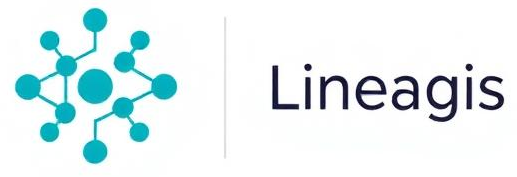

<p align="center">
  
</p>

# Lineagis

> Lineagis is an open-source **software supply-chain lineage and provenance engine**. It builds a unified directed graph across pipelines, artifacts, and dependencies so teams can trace, reason about, and secure their software supply chain.

**Core idea:** everything is a node; everything meaningful is an edge.

---

## Overview

Modern supply chains span CI/CD, registries, SBOM tools, and runtime environments — but the relationships between them are rarely connected in one queryable model.

Lineagis fills the **missing graph layer** for software supply chain security: a deterministic provenance engine that links commits, builds, artifacts, dependencies, and deployments into a single DAG you can traverse from the CLI.

Rather than another siloed scanner or registry, Lineagis is a **lineage graph** — cross-tool provenance you can query.

## Goals

* Unify supply-chain signals into one provenance graph
* Trace artifact ancestry from runtime back to source commits
* Detect broken or incomplete lineage chains
* Support impact and blast-radius analysis across dependencies
* Expose a developer-first CLI with deterministic, reproducible outputs
* Build on open standards (OCI, CycloneDX, SPDX, Sigstore)

---

## Core Concepts

### Provenance graph

Lineagis models software as a **typed directed acyclic graph (DAG)**:

| Node type | Represents |
|-----------|------------|
| **Commit** | A git revision |
| **Build** | A CI/CD pipeline run |
| **Artifact** | A build output (image, package, binary) |
| **Dependency** | An internal or external dependency |
| **Deployment** | A runtime deployment event |

| Edge type | Meaning |
|-----------|---------|
| `produced_by` | artifact → build |
| `built_from` | build → commit |
| `depends_on` | artifact → dependency |
| `deployed_to` | artifact → deployment |
| `derived_from` | artifact → artifact |

Same inputs → same graph → same query results.

### System layers

Lineagis is organized into five layers (see [Architecture Overview](docs/lineagis_architecture_overview.md)):

```text
  ┌─────────────────────────────────────────┐
  │  CLI + API                              │
  ├─────────────────────────────────────────┤
  │  Query Engine   (trace, impact, upstream)│
  ├─────────────────────────────────────────┤
  │  Graph Core     (nodes, edges, DAG)     │
  ├─────────────────────────────────────────┤
  │  Normalization  (dedupe, identity resolve)│
  ├─────────────────────────────────────────┤
  │  Ingestion      (CI, SBOM, registry, git)│
  └─────────────────────────────────────────┘
```

**Ingestion** collects raw signals from CI/CD, SBOMs (CycloneDX / SPDX), container registries, and git metadata. **Normalization** maps heterogeneous formats to canonical Lineagis objects. The **graph core** stores nodes and edges with DAG integrity. The **query engine** runs traversals (ancestry, impact, upstream/downstream). The **CLI** is the primary interface for MVP; REST/GraphQL and a UI come later.

### Inputs (target v1.0)

* SBOM JSON (CycloneDX, SPDX)
* Git commit metadata
* Build artifacts (hashes, images, packages)
* CI/CD pipeline events (GitHub Actions, GitLab CI, Jenkins)
* Container registry manifests (OCI/Docker)

---

## CLI (target v1.0)

The graph-first CLI is the north-star interface:

```bash
# Ingest supply-chain data
lineagis ingest sbom.json

# Trace lineage to root commits
lineagis trace artifact@sha256:abc123

# Explain why an artifact exists in the graph
lineagis why artifact@sha256:abc123

# Visualize the DAG (optional Graphviz output)
lineagis visualize artifact@sha256:abc123
```

Planned v1.1–v1.2 commands include `impact`, `upstream`, and `downstream` for cross-source graphs and dependency blast-radius queries. See [Design & Roadmap](docs/lineagis_design.md).

---

## Current release (v0.3)

The repository today ships a **foundational trust platform** — OCI artifact publishing, Sigstore signing, provenance attestations, policy enforcement, and consumer workflows. This layer provides signed, policy-governed artifacts that will feed the lineage graph as ingestion sources mature.

| Area | Capabilities |
|------|----------------|
| **Publishing** | OCI artifact push, immutable `sha256:` digests, semver tags |
| **Signing** | Sigstore keyless signing (GitHub Actions), server-side verification |
| **CLI** | `lineagis publish`, `lineagis inspect`, `lineagis verify`, `lineagis login`, `lineagis pull` |
| **Policy** | Signature requirements, trusted publishers, digest-pin warnings |
| **Integrations** | GitHub Actions composite actions, namespace webhooks |

Detailed v0.3 scope: [mvp-v0.3-release.md](docs/sdlc/mvp-v0.3-release.md). Requirements and acceptance criteria: [docs/specs/](docs/specs/README.md).

### Example: publish and verify (today)

```bash
# Publish from CI or local dev (see guides for token/signing setup)
lineagis publish dist/* --namespace gh/org/app --artifact app --tag v1.0.0

# Inspect trust status
lineagis inspect sha256:<digest> --namespace gh/org/app --artifact app

# Consume with verification (v0.3)
lineagis login
lineagis pull gh/org/app/app@sha256:<digest> -o ./out --verify
```

Guides: [GitHub Actions publish](docs/guides/github-actions-publish.md) · [Consumer getting started](docs/guides/consumer-getting-started.md) · [Quickstart (local dev)](docs/guides/quickstart.md)

**What inspect proves:** cryptographic signature validity, tamper evidence for the registered digest, and active namespace policy results. **What it does not prove:** that an artifact is safe or free of vulnerabilities. Pin releases by digest (`sha256:…`), not mutable tags alone.

---

## Roadmap

| Version | Focus | Highlights |
|---------|-------|------------|
| **v1.0** | Graph MVP | In-memory DAG, SBOM/git/artifact ingest, `trace` / `why`, JSON + Graphviz output |
| **v1.1** | Multi-source | GitHub Actions / GitLab CI / registry ingestion, anomaly detection, persistence |
| **v1.2** | Cross-graph queries | `impact`, `upstream`, `downstream`, HTML/YAML exports, optional Sigstore attestations |
| **v2.x** | Scale & automation | Persistent graph DB, UI, alerts, multi-repo graphs, compliance reporting |

Full roadmap and integration plan: [docs/lineagis_design.md](docs/lineagis_design.md).

---

## Architecture (current stack)

The v0.3 control plane and registry stack that exists today:

```text
                +-------------------+
                | Lineagis CLI      |
                +-------------------+
                         |
                         v
                +-------------------+
                | Lineagis API      |
                +-------------------+
                    |          |
                    v          v
           +-------------+   +----------------+
           | OCI Registry|   | Metadata DB    |
           +-------------+   +----------------+
                    |
                    v
           +------------------+
           | Object Storage   |
           +------------------+
```

Target repository layout for the graph engine: [docs/lineagis_architecture_overview.md#2-repository-structure](docs/lineagis_architecture_overview.md#2-repository-structure).

### Technology

| Layer | Choice |
|-------|--------|
| Backend | Go |
| Graph store (MVP) | In-memory DAG |
| Graph store (scale) | Postgres edge model, Neo4j / Dgraph (v2+) |
| Artifacts | OCI Distribution Spec, S3-compatible storage |
| Metadata | PostgreSQL |
| Identity & signing | Sigstore, OIDC, GitHub Actions |

---

## Development

[](https://github.com/BrendenWalker/lineagis/actions/workflows/ci.yml)

### Prerequisites

* Go 1.23 or newer
* [golangci-lint](https://golangci-lint.run/welcome/install/) v2 (for local linting)
* Docker Engine and Compose v2 (for the local dev stack)

### Build and test

```bash
make build    # produces bin/lineagis and bin/lineagis-api
make test     # unit tests + coverage.out
make lint     # golangci-lint
```

Run the CLI:

```bash
./bin/lineagis --version
```

Publish a release directory (requires stack up and tokens from `.env.example`):

```bash
export LINEAGIS_API_URL=http://localhost:8080
export LINEAGIS_REGISTRY_URL=http://localhost:5000
export LINEAGIS_TOKEN=dev-local-token
./bin/lineagis publish dist/ --namespace gh/acme/widget --artifact widget --tag v1.0.0
```

CI runs on every pull request and push to `main`. Required checks: `lint`, `test`, `build`, and `keyless-publish`. See [.github/BRANCH_PROTECTION.md](.github/BRANCH_PROTECTION.md).

### Local development stack

Start Postgres, MinIO, a [Zot](https://zotregistry.dev/) OCI registry, and the Lineagis API:

```bash
cp .env.example .env   # optional; defaults match .env.example
make compose-up
```

| Service | URL | Purpose |
|---------|-----|---------|
| Lineagis API | http://localhost:8080 | Control plane (`/v1/...`) |
| OCI Registry | http://localhost:5000 | Zot registry (S3 via MinIO) |
| PostgreSQL | localhost:5432 | Metadata database |
| MinIO | http://localhost:9000 | S3-compatible object storage |

Environment variables: see [`.env.example`](.env.example).

Verify health:

```bash
curl http://localhost:8080/healthz
curl http://localhost:8080/readyz
```

Full operator smoke test:

```bash
make build          # optional
make smoke          # compose-up + scripts/smoke-stack.sh
```

Stop the stack: `make compose-down`. Operator validation details: [docs/guides/operator-validation.md](docs/guides/operator-validation.md).

<details>
<summary>Windows development notes</summary>

Go installs to `C:\Program Files\Go\bin`. Restart your terminal after install if `go` is not found.

**Git Bash** — add to `~/.bashrc` if needed:

```bash
export PATH="$PATH:/c/Program Files/Go/bin"
```

**GNU Make** — use MinGW's `mingw32-make` (not Embarcadero `make`):

```powershell
mingw32-make test; mingw32-make build
```

PowerShell 5.1 does not support `&&`. On Windows, run tests without `-race` (requires CGO). Use `.\bin\lineagis.exe --version`.

</details>

---

## Documentation

| Document | Description |
|----------|-------------|
| [Architecture Overview](docs/lineagis_architecture_overview.md) | Graph model, layers, queries, storage options |
| [Design & Roadmap](docs/lineagis_design.md) | MVP v1.0–v1.2, integrations, strategic positioning |
| [Specs index](docs/specs/README.md) | FR/NFR requirements for the current trust platform |
| [Security](SECURITY.md) | Vulnerability reporting |

---

## License

Licensed under the Apache License 2.0.

---

## Vision

Lineagis aims to be the **queryable graph layer** the supply chain has been missing:

* cross-tool provenance in one model
* traceability as the primary primitive
* deterministic outputs for automation and compliance
* open standards, open governance, developer-first tooling

Software supply chains should be **observable**, not opaque.
