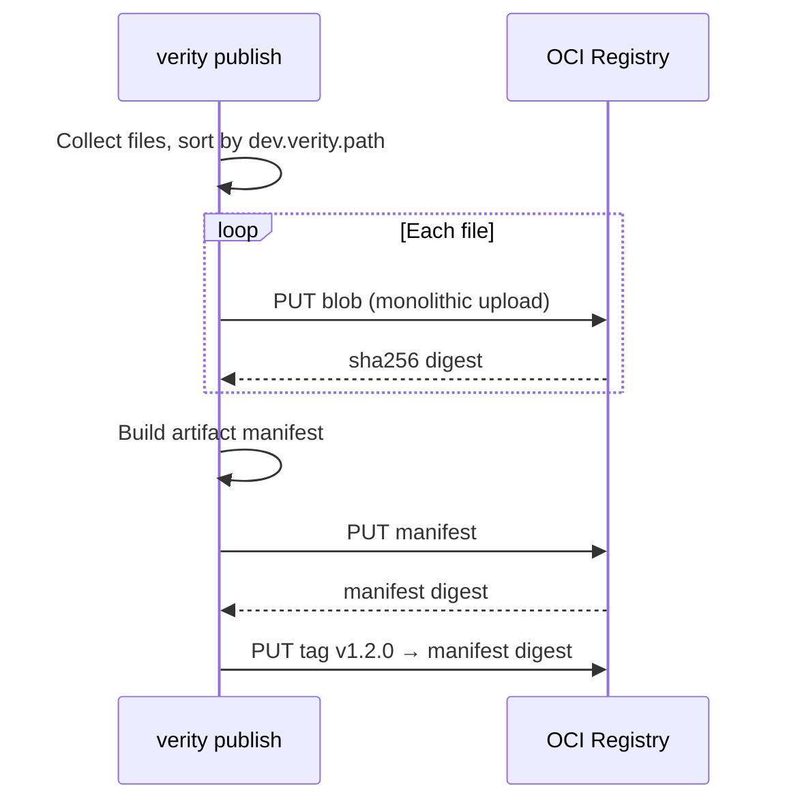

# ADR-0001: Artifact manifest layout for generic and multi-file releases

**Status:** Accepted  
**Date:** 2026-05-24  
**Deciders:** Verity maintainers  
**Resolves:** [OQ-PUB-001](../specs/01-artifact-publishing.md#open-questions)  
**Implements (design):** [FR-PUB-009](../specs/01-artifact-publishing.md#functional-requirements)  
**Related specs:** [01-artifact-publishing.md](../specs/01-artifact-publishing.md), [metadata-model.md](../specs/metadata-model.md), [05-developer-experience.md](../specs/05-developer-experience.md)

## Context

Verity publishes software artifacts (wheels, tarballs, binaries, checksum files) to an OCI Distribution-compatible registry. Maintainers expect a single command for a release directory:

```text
verity publish dist/*
```

That implies **one manifest digest per release**, with every file in the publish path represented as addressable blob content. Signatures, attestations, and metadata index rows attach to the **manifest digest** ([FR-META-003](../specs/metadata-model.md#storage-placement-matrix)), not to individual file digests.

The publishing spec leaves two questions open:

| ID | Question |
|----|----------|
| **OQ-PUB-001** | Standard OCI artifact type vs custom manifest media type for generic packages? |
| **OQ-PUB-002** | Maximum artifact size limits for MVP? |

This ADR resolves **OQ-PUB-001** and defines the layout **FR-PUB-009** must follow. Size limits (**OQ-PUB-002**) are noted as an operational constraint, not a format decision.

### Options considered

| Option | Summary | Verdict |
|--------|---------|---------|
| **A. OCI Image manifest** | Reuse `application/vnd.oci.image.manifest.v1+json` with a minimal config blob and file layers | Viable fallback; rejected as primary because non-container artifacts require a dummy config blob and invite tool confusion |
| **B. OCI Artifact manifest** | Use `application/vnd.oci.artifact.manifest.v1+json` with one layer per file | **Selected** — purpose-built for non-image artifacts; no config blob; supported by ORAS and go-containerregistry |
| **C. Custom Verity manifest** | e.g. `application/vnd.verity.release.manifest.v1+json` | Rejected — breaks generic OCI client compatibility ([FR-PUB-001](../specs/01-artifact-publishing.md), [AC-PUB-005](../specs/01-artifact-publishing.md#acceptance-criteria)) |
| **D. One blob per file, no bundle manifest** | Each file tagged independently | Rejected — violates [FR-PUB-009](../specs/01-artifact-publishing.md) and prevents a single signing/trust anchor per release |

## Decision

Verity **SHALL** publish generic and multi-file releases using the **OCI Artifact manifest** format:

| Field | Value |
|-------|-------|
| Manifest `schemaVersion` | `2` |
| Manifest `mediaType` | `application/vnd.oci.image.manifest.v1+json` (OCI Image Spec v1.1 wire format) |
| Manifest `artifactType` | `application/vnd.verity.release.v1+json` |
| Layers | One OCI layer descriptor per file in the publish set |
| Layer blob digest | SHA-256 of raw file bytes ([NFR-PUB-002](../specs/01-artifact-publishing.md#non-functional-requirements)) |
| Config blob | OCI empty JSON descriptor (`application/vnd.oci.empty.v1+json`, `{}`) — placeholder required by registries such as Zot that follow OCI 1.1; not used for release content |
| Registry repository | `{namespace}/{artifact}` — namespace path segments preserved (e.g. `gh/acme/widget`) |
| Tag | Applied to the **manifest** digest via OCI Distribution tag API |

### Layer ordering (digest stability)

Layers **MUST** be sorted **lexicographically by `dev.verity.path`** (UTF-8 byte order) before manifest construction. Identical file sets MUST produce identical manifest digests ([FR-PUB-007](../specs/01-artifact-publishing.md), [AC-PUB-002](../specs/01-artifact-publishing.md)).

### Layer annotations

Each layer descriptor **MUST** include:

| Annotation key | Required | Description |
|----------------|----------|-------------|
| `dev.verity.path` | Yes | Path relative to the publish root, POSIX-style (`/`). Example: `mypkg-1.0.0-py3-none-any.whl` |
| `org.opencontainers.image.title` | Yes | Basename of the file (final path segment). Example: `mypkg-1.0.0-py3-none-any.whl` |

Each layer descriptor **MAY** include:

| Annotation key | Description |
|----------------|-------------|
| `dev.verity.size` | Decimal string of byte length (informational; `size` field is authoritative) |
| `org.opencontainers.image.created` | RFC 3339 timestamp of local file mtime at publish time |

Manifest-level annotations **MAY** include:

| Annotation key | Description |
|----------------|-------------|
| `dev.verity.publish.root` | Original publish argument (e.g. `dist/` or `dist/*`) |
| `dev.verity.file.count` | Number of layers as a decimal string |

### Layer media types

Use the table below based on file extension (case-insensitive). When multiple rules match, use the most specific row.

| File pattern | Layer `mediaType` |
|--------------|-------------------|
| `*.whl` | `application/zip` |
| `*.tar.gz`, `*.tgz` | `application/vnd.oci.image.layer.v1.tar+gzip` |
| `*.tar` | `application/vnd.oci.image.layer.v1.tar` |
| `*.zip` | `application/zip` |
| `*.json` | `application/json` |
| Everything else | `application/octet-stream` |

Media types describe content for tooling hints only. Verification always uses blob digest equality.

### Single-file releases

A publish of one file (e.g. `verity publish dist/mypkg-1.0.0-py3-none-any.whl`) **uses the same layout**: one artifact manifest with **one** layer. Verity MUST NOT expose a “blob-only, no manifest” publish path, so every version has a manifest digest ([FR-META-001](../specs/metadata-model.md#functional-requirements)).

### Directory publish semantics

When the publish path is a directory (e.g. `dist/` or `dist/*`):

1. Recursively collect **files only** (skip directories as layers).
2. Compute each file’s path relative to the directory root → `dev.verity.path`.
3. **Do not** follow symlinks (publish fails with a clear error if a symlink is encountered).
4. Hidden files (names starting with `.`) are **included** unless `--exclude` is added in a future CLI flag; MVP includes all files.

### Idempotency and immutability

| Operation | Expected behavior |
|-----------|-------------------|
| Push same file bytes again | Same blob digest; upload is a no-op if blob already exists |
| Push same file set with same ordering and annotations | Same manifest digest |
| Push changed file content | New blob digest; new manifest digest if any layer changes |
| Move tag to new manifest digest | Old manifest and all its layer blobs remain pullable by digest |

### Size limits (OQ-PUB-002)

For MVP:

| Limit | Value | Rationale |
|-------|-------|-----------|
| Maximum layer (file) size | **512 MiB** | Monolithic blob upload in `internal/registry`; sufficient for typical OSS wheels/tarballs |
| Maximum layers per manifest | **256** | Guards against accidental `node_modules/` publish; aligns with practical release sizes |
| Maximum total release size | **2 GiB** | Sum of layer sizes; operator may raise via config later |

Files exceeding these limits fail publish with an actionable error. Chunked/resumable upload for larger layers is deferred.

## Examples

### Example repository layout

Publish command:

```bash
verity publish dist/* \
  --namespace gh/acme/widget \
  --artifact widget \
  --tag v1.2.0
```

Registry repository: `gh/acme/widget/widget`  
Tag `v1.2.0` → manifest digest below.

### Example `dist/` contents

```text
dist/
  widget-1.2.0-py3-none-any.whl
  widget-1.2.0.tar.gz
  SHA256SUMS
```

### Example manifest JSON

Layers are shown in sorted `dev.verity.path` order: `SHA256SUMS`, then tarball, then wheel.

```json
{
  "schemaVersion": 2,
  "mediaType": "application/vnd.oci.image.manifest.v1+json",
  "artifactType": "application/vnd.verity.release.v1+json",
  "config": {
    "mediaType": "application/vnd.oci.empty.v1+json",
    "digest": "sha256:44136fa355b3678a1146ad16f7e8649e94fb4fc21fe77e8310c060f61caaff8a",
    "size": 2
  },
  "annotations": {
    "dev.verity.file.count": "3",
    "dev.verity.publish.root": "dist/"
  },
  "layers": [
    {
      "mediaType": "application/octet-stream",
      "digest": "sha256:aaaaaaaaaaaaaaaaaaaaaaaaaaaaaaaaaaaaaaaaaaaaaaaaaaaaaaaaaaaaaaaa",
      "size": 256,
      "annotations": {
        "dev.verity.path": "SHA256SUMS",
        "org.opencontainers.image.title": "SHA256SUMS"
      }
    },
    {
      "mediaType": "application/vnd.oci.image.layer.v1.tar+gzip",
      "digest": "sha256:bbbbbbbbbbbbbbbbbbbbbbbbbbbbbbbbbbbbbbbbbbbbbbbbbbbbbbbbbbbbbbbb",
      "size": 1048576,
      "annotations": {
        "dev.verity.path": "widget-1.2.0.tar.gz",
        "org.opencontainers.image.title": "widget-1.2.0.tar.gz"
      }
    },
    {
      "mediaType": "application/zip",
      "digest": "sha256:cccccccccccccccccccccccccccccccccccccccccccccccccccccccccccccccc",
      "size": 524288,
      "annotations": {
        "dev.verity.path": "widget-1.2.0-py3-none-any.whl",
        "org.opencontainers.image.title": "widget-1.2.0-py3-none-any.whl"
      }
    }
  ]
}
```

Replace `sha256:aa…`, `sha256:bb…`, `sha256:cc…` with actual SHA-256 digests of the file bytes.

### Publish sequence



After OCI push, the CLI registers the manifest digest and tag with the Verity API (Milestone 6; out of scope for this ADR).

### Pull / inspect behavior (informative)

Consumers resolving `gh/acme/widget/widget:v1.2.0`:

1. Registry tag lookup → manifest digest
2. Fetch manifest JSON
3. For each layer, fetch blob by digest
4. Reconstruct files using `dev.verity.path` (or `org.opencontainers.image.title` for flat layouts)

`verity inspect` reports trust against the **manifest digest**, not individual layers.

## Consequences

### Positive

- **Standards-aligned:** OCI Artifact manifest is the intended format for non-container content; no dummy config blob.
- **Tool-compatible:** Push/pull works with ORAS, crane (artifact mode), and `go-containerregistry` ([AC-PUB-005](../specs/01-artifact-publishing.md)).
- **Stable digests:** Sorted layers and fixed annotation keys make CI retries idempotent ([FR-PUB-007](../specs/01-artifact-publishing.md)).
- **Single trust anchor:** One manifest digest per release simplifies signing and metadata indexing ([FR-META-003](../specs/metadata-model.md)).
- **Uniform code path:** Single-file and multi-file releases share the same manifest builder.

### Negative / trade-offs

- **Annotation dependency:** Tools that only understand container image manifests may not display artifact manifests usefully without Verity-aware logic.
- **Sorted layers, not user order:** File order in the manifest is canonical, not presentation order.
- **512 MiB cap:** Large binaries require future chunked-upload work (OQ-PUB-002 follow-up).
- **`dev.verity.*` namespace:** Custom annotations are Verity-specific; documented here for interop between Verity CLI, API, and future Actions.

### Neutral

- Container **images** published to the same registry may continue using OCI **Image** manifests (`application/vnd.oci.image.manifest.v1+json`). Verity does not convert images to artifact manifests. [FR-PUB-010](../specs/01-artifact-publishing.md) is satisfied by supporting both manifest types in the registry client.

## Implementation mapping

| Milestone | Work item | Delivers |
|-----------|-----------|----------|
| **M04 — OCI registry** | [#31](https://github.com/BrendenWalker/verity/issues/31) spike | This ADR (approval) |
| **M04** | [#29](https://github.com/BrendenWalker/verity/issues/29), [#30](https://github.com/BrendenWalker/verity/issues/30), [#79](https://github.com/BrendenWalker/verity/issues/79) | `internal/registry` blob + manifest push/pull; dev stack uses Zot for artifact manifest acceptance |
| **M06 — Publishing** | [#37](https://github.com/BrendenWalker/verity/issues/37) (+ recommended FR-PUB-009 story) | CLI walks `dist/*`, builds manifest per this ADR, registers with API |

## Compliance checklist

Use when reviewing PRs that touch publishing or registry code:

- [ ] Manifest `mediaType` is `application/vnd.oci.image.manifest.v1+json` with `artifactType` `application/vnd.verity.release.v1+json`
- [ ] Config descriptor is the OCI empty JSON blob only (no release content in config)
- [ ] Each file is exactly one layer; layer blob digest is SHA-256 of raw bytes
- [ ] Layers sorted by `dev.verity.path` before manifest serialization
- [ ] Required annotations present on every layer
- [ ] Re-publishing identical content yields identical manifest digest
- [ ] Tag points to manifest digest, not a layer digest
- [ ] Signatures/attestations reference manifest digest

## References

- [OCI Image Spec — Artifact manifest](https://github.com/opencontainers/image-spec/blob/main/artifact.md)
- [OCI Distribution Spec](https://github.com/opencontainers/distribution-spec)
- [ORAS project](https://oras.land/)
- [go-containerregistry](https://github.com/google/go-containerregistry)
- Verity [01-artifact-publishing.md](../specs/01-artifact-publishing.md)
- Verity [metadata-model.md](../specs/metadata-model.md)
