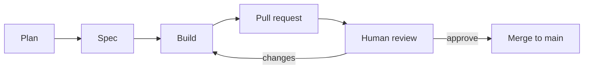

# Software development lifecycle (SDLC)

How Verity work is planned, specified, built, and reviewed—written for humans and AI assistants using any tooling (issues, chat, IDE agents, CI).

**Entry point for agents:** [AGENTS.md](../../AGENTS.md)

---

## Principles

1. **Specs define behavior** — `docs/specs/` is the source of truth for requirements; implementation must be traceable to `FR-*` and `AC-*`.
2. **Humans own priority and merge** — AI drafts and implements; humans approve plans, spec changes, and pull requests.
3. **Small, reviewable increments** — Prefer one story per PR over large unreviewable batches.
4. **MVP discipline** — Respect Must / Should / Deferred in [00-overview.md](../specs/00-overview.md#mvp-delivery-matrix); defer scope creep to a new milestone.

---

## Workflow



### 1. Plan

**Goal:** Agree on *what* problem is being solved and *whether* to do it now.

| Step | Action |
|------|--------|
| 1 | Capture the request (issue, chat, or milestone doc). |
| 2 | Find related spec sections and requirement IDs. |
| 3 | Classify MVP impact (Must / Should / Deferred). |
| 4 | Note dependencies (other stories, infra, migrations). |
| 5 | Write a short plan: approach, risks, out-of-scope. |
| 6 | **Human checkpoint:** Approve plan before substantial Spec or Build work. |

**Plan artifact (minimal):**

```markdown
## Goal
<one sentence>

## Spec traceability
- FR-… / US-… / AC-…

## Approach
- …

## Out of scope
- …

## Open questions
- …
```

---

### 2. Spec

**Goal:** Organize work and make acceptance testable before code.

#### Work hierarchy

```
Epic
 └── Milestone (shippable increment)
      └── Story (user-visible, PR-sized)
           └── Task (implementation checklist)
```

| Level | Definition | Example |
|-------|------------|---------|
| **Epic** | Theme spanning multiple milestones | “Signing and verification” |
| **Milestone** | Coherent deliverable for a phase or release slice | “Phase 1 — OCI publish + API bootstrap” |
| **Story** | One persona outcome, completable in days | “As a maintainer, push artifact with digest returned” |
| **Task** | Concrete engineering step | “Add POST /artifacts handler” |

#### Where artifacts live

Use **GitHub Issues + Milestones** when available; otherwise use markdown under `docs/sdlc/milestones/` (create as needed). In all cases:

- Link to the canonical spec file(s) in `docs/specs/`.
- Use requirement IDs from [spec README](../specs/README.md#requirement-id-conventions).

| Artifact | Template | Tracker alternative |
|----------|----------|---------------------|
| Milestone | [_template-milestone.md](_template-milestone.md) | GitHub Milestone + umbrella issue |
| Story | [_template-story.md](_template-story.md) | GitHub Issue |
| Feature requirements | [_template.md](../specs/_template.md) | `docs/specs/<area>.md` |

#### When to edit `docs/specs/`

| Situation | Action |
|-----------|--------|
| New capability or changed behavior | Add/update FR, NFR, AC in the relevant spec |
| Clarification only (no behavior change) | Story/issue comment; optional spec wording fix |
| Spike / prototype | Story marked “spike”; no spec change until human promotes to committed scope |
| Deferred roadmap item | Do not implement; note in milestone “out of scope” |

#### Story readiness checklist

Before Build:

- [ ] Story has clear **acceptance criteria** (see template).
- [ ] Mapped to **FR-*` / **`AC-*`** (or new IDs added to spec with human review).
- [ ] **Priority** aligned with MVP matrix (Must vs Should).
- [ ] **Dependencies** identified (blocked-by links).
- [ ] Assigned to a **milestone**.

---

### 3. Build

**Goal:** Implement the story on a branch, prove it with tests, open a PR for human review.

#### Branch strategy

```
main (protected)
  ├── milestone/phase-1-bootstrap
  │     ├── story/42-api-health-endpoint
  │     └── story/43-db-migrations
  └── story/51-cli-version-flag
```

| Pattern | Use when |
|---------|----------|
| `milestone/<name>` | Multiple stories land together; integration branch optional |
| `story/<id>-<slug>` | Default: one story, one PR |
| `fix/<slug>` | Bug or tiny change without milestone |

**Rules:**

- Branch from up-to-date `main`.
- Keep PRs focused; split if diff grows beyond reasonable review size.
- Rebase or merge `main` before review if the branch aged.

#### Implementation checklist

1. Create branch from approved story/milestone.
2. Implement minimal change set; follow [AGENTS.md](../../AGENTS.md#code-conventions).
3. Add/update tests and docs touched by behavior changes.
4. Run local verification (`go test ./...`, `make lint`, relevant `make` smoke targets).
5. Open PR with story link, spec IDs, and test plan.
6. Address review feedback on the same branch.
7. **Stop** — human merges.

#### Pull request description

```markdown
## Story
Closes #<issue> / docs/sdlc/milestones/.../story-42.md

## Spec
- FR-API-00x, AC-API-00x

## Summary
<what changed>

## Test plan
- [ ] go test ./...
- [ ] …
```

#### AI agent restrictions

- Do not commit, push, or merge unless the human explicitly asks.
- Do not skip CI or hooks unless the human explicitly asks.
- Do not commit secrets or production credentials.

---

### 4. Review and merge (human)

| Responsibility | Human | AI |
|----------------|-------|-----|
| Code review | ✓ | Address comments when asked |
| Spec correctness | ✓ | Propose spec diffs when behavior changed |
| Merge to `main` | ✓ | — |
| Release / deploy | ✓ | — |

After merge: update story/milestone status; close linked issues.

---

## Traceability matrix (example)

| Story | Spec | FR | AC | PR |
|-------|------|----|----|-----|
| API health for k8s probes | api.md | FR-API-010 | AC-API-010 | #12 |

Maintain this in the issue body or milestone doc table.

---

## Phase alignment (Verity MVP)

Informative mapping to [overview phases](../specs/00-overview.md#phase-mapping-informative):

| Milestone (informative) | Spec focus |
|-------------------------|------------|
| Phase 1 | All **Must** items in delivery matrix |
| Phase 2 | **Should** items (provenance, GitHub Actions, policies) |
| Phase 3 | **Deferred** items |

Name milestones explicitly (e.g. `milestone/phase-1-must`) rather than only “Phase 1”.

---

## Related documents

- [AGENTS.md](../../AGENTS.md) — concise agent instructions
- [docs/specs/README.md](../specs/README.md) — requirement conventions
- [docs/specs/00-overview.md](../specs/00-overview.md) — MVP boundaries
- [layer-b-v0.2-plan.md](layer-b-v0.2-plan.md) — v0.2 Attribution milestone plan (active)
