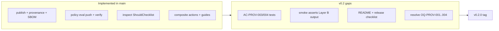

# Layer B (v0.2 Attribution) — implementation plan

**Branch:** `milestone/v0.2-attribution`  
**Status:** Planning (not yet v0.2.0 release)  
**Authoritative scope:** [docs/specs/00-overview.md](../specs/00-overview.md)

## Goal

Complete **Layer B — Attribution (v0.2)**: close gaps between implemented Phase 2 code and spec acceptance criteria, add traceable CI/tests, resolve open provenance questions, and ship a v0.2 release checklist—**without** starting Deferred (Phase 3) work.

## Context

| Layer | Theme | v0.2 focus |
|-------|--------|------------|
| **B — Attribution** | Provenance verify on inspect, GitHub Actions golden path, honest trust reports | All **Should** rows in the [MVP delivery matrix](../specs/00-overview.md#mvp-delivery-matrix) |

**Authoritative Should capabilities for v0.2:**

- SLSA provenance + SBOM attach ([03-provenance-metadata.md](../specs/03-provenance-metadata.md))
- Provenance verification on inspect (`FR-PROV-006`, `FR-PROV-009`)
- GitHub Actions golden path (`FR-OV-008`, `FR-DX-001`–`004`)
- Policy: `trusted-publishers`, `repository-ownership`, `require-provenance` when configured ([04-policy-enforcement.md](../specs/04-policy-enforcement.md))
- Push-time evaluation for all configured rules (`FR-POL-012`) — **already implemented** in `internal/api/policy_eval.go` and proven in `.github/workflows/publish-keyless-smoke.yml` (wrong-workflow `SetTag` block)

**GitHub issue state:** Milestones **12–14** tasks (#58–#66) are **closed** with implementation notes, but several acceptance items were never fully proven (e.g. #60 left “tampered provenance” unchecked). Open issues on the board are mostly Deferred (#18, #67, #68). v0.2 work is primarily **gap closure + release engineering**, not greenfield features.

## Workstream checklist

Track progress on this branch (or child story branches). Suggested PR order at the end.

| ID | Task | Spec / AC | Status |
|----|------|-----------|--------|
| W1 | Resolve OQ-PROV-001..004 in specs | OQ-PROV-* | done |
| W2 | `attestations_test.go` + inspect `ShouldChecklist` tests; fix `repositoryLine` honesty if needed | AC-PROV-003, NFR-OV-005 | done |
| W3 | Commit query API + store method | AC-PROV-004, FR-PROV-010 | done |
| W4 | Extend `publish-keyless-smoke`; add `phase2-should-test-mapping.md` | AC-OV-003, AC-PROV-001/002 | done |
| W5 | `mvp-v0.2-release.md` + README/guides; GitHub milestone + gap issues | AC-OV-003 | done (docs); milestone/issues manual |

## Current implementation snapshot

| Area | Status | Key files |
|------|--------|-----------|
| Publish + provenance + SBOM | Done | `internal/publish/publish.go`, `internal/publish/attest.go` |
| Attestation verify | Done | `internal/api/attestations.go` |
| Trust status fields | Done | `internal/api/trust.go` |
| Inspect Should lines | Done | `internal/inspect/inspect.go` |
| Should policies | Done | `internal/api/policy_eval.go` |
| GHA golden path | Done | `docs/guides/github-actions-publish.md`, `.github/actions/verity-publish/` |
| Phase 2 CI proof | **Partial** | Smoke checks `provenance` but not `provenance_verified`, SBOM, or README example lines |
| AC-PROV-003 tamper test | **Missing** | No attestation tests; #60 DoD unchecked |
| AC-PROV-004 query by commit | **Missing** | DB has `commit_sha`; no API route |
| Docs vs behavior | **Stale** | README still shows v0.1 inspect example |

## Workstreams (detail)

### 1. Human decisions (spec gates — do first)

Resolve or document defaults in [03-provenance-metadata.md](../specs/03-provenance-metadata.md) before widening CI assertions:

| ID | Decision | Suggested default for v0.2 |
|----|----------|---------------------------|
| OQ-PROV-001 | Minimum SLSA build level | **SLSA Build L1** (provenance present + signed) |
| OQ-PROV-002 | SBOM required on publish? | **Optional** — warn on inspect when missing |
| OQ-PROV-003 | SPDX vs CycloneDX | **Both accepted**; document one example in guides |
| OQ-PROV-004 | Repo ownership source | **Provenance + namespace `gh/owner/repo` match** (no GitHub API in v0.2) |

Record in spec “Resolved open questions” per [AGENTS.md](../../AGENTS.md).

### 2. Acceptance tests and CI

Add **`docs/sdlc/phase2-should-test-mapping.md`** (mirror [phase1-must-test-mapping.md](phase1-must-test-mapping.md)):

| AC | Work |
|----|------|
| AC-OV-003 | Extend `publish-keyless-smoke.yml`: inspect asserts provenance verified + workflow (+ SBOM when `--sbom`) |
| AC-PROV-001 | Assert `trust.json` has `repository`, `commit`, `workflow` after keyless publish |
| AC-PROV-002 | Smoke step with minimal SPDX/CycloneDX + `--sbom` |
| AC-PROV-003 | `internal/api/attestations_test.go`: tampered statement/bundle → not verified |
| AC-PROV-004 | `GET /v1/namespaces/{ns}/artifacts?commit={sha}` (or provenance query) + store method |

Add `internal/inspect/inspect_test.go` coverage for `ShouldChecklist`.

**Inspect honesty:** `repositoryLine` may show `✓ Repository verified` without `repository-ownership` configured; align with `FR-PROV-012`.

### 3. Release artifact

Add **`docs/sdlc/mvp-v0.2-release.md`** parallel to [mvp-v0.1-release.md](mvp-v0.1-release.md):

- AC table: `AC-OV-003`, `AC-PROV-001`–`004`, Should policy ACs
- Required CI checks
- Errata for v0.1 doc (e.g. FR-POL-012 implemented)
- Out of scope: Deferred items, `verity pull`/`login`, Layer C

### 4. Documentation

- Update [README.md](../../README.md) inspect example to Layer B target
- Update [github-actions-publish.md](../guides/github-actions-publish.md) when AC-PROV-003 is proven
- Link phase2 mapping + v0.2 checklist from [docs/sdlc/README.md](README.md)

### 5. GitHub hygiene

- Milestone **17 - v0.2 Attribution**
- Gap issues: AC-PROV-003, AC-PROV-004, AC-OV-003 smoke, docs alignment

## Suggested PR sequence

| PR | Scope | Spec refs |
|----|--------|-----------|
| 1 | Resolve OQ-PROV-* in specs | OQ-PROV-001..004 |
| 2 | Attestations + inspect Should tests + repositoryLine | AC-PROV-003, NFR-OV-005 |
| 3 | Commit query API | AC-PROV-004 |
| 4 | Smoke + phase2 mapping | AC-OV-003, AC-PROV-001/002 |
| 5 | mvp-v0.2-release + README/guides | AC-OV-003 |

## Out of scope

- **Deferred / Phase 3** (#18, #67, #68): CVE blocking, federation, transparency-log UX
- **Layer C (v0.3):** webhooks, deeper governance
- **DX Should (not Attribution theme):** `verity login`, `verity pull`, `verity policy` CLI

## Success criteria (v0.2 done)

1. All **Should** attribution matrix rows have proof in `phase2-should-test-mapping.md` + CI.
2. `publish-keyless-smoke` shows **verified** provenance and optional SBOM path.
3. README/guides match actual inspect behavior.
4. OQ-PROV-001..004 resolved in specs.
5. Tag **v0.2.0** with `mvp-v0.2-release.md` signed off.

## Related

- [mvp-v0.1-release.md](mvp-v0.1-release.md) — v0.1 bar (complete)
- [phase1-must-test-mapping.md](phase1-must-test-mapping.md) — Phase 1 traceability
- [AGENTS.md](../../AGENTS.md) — branching: `milestone/<short-name>`
