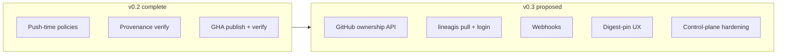

# Layer C (v0.3 Governance) — implementation plan

**Branch:** `milestone/v0.3-governance`  
**Status:** **Complete** — merged [#111](https://github.com/BrendenWalker/lineagis/pull/111); release tag pending [mvp-v0.3-release.md](mvp-v0.3-release.md)  
**Authoritative scope:** [docs/specs/00-overview.md](../specs/00-overview.md)

## Goal

Deliver **Layer C — Governance (v0.3+)**: deepen operator and consumer trust controls, close adoption gaps from the [#106](https://github.com/BrendenWalker/lineagis/issues/106) security review, and extend the control plane—**without** starting Deferred Phase 3 items (CVE, federation, ecosystem adapters).

## Context

| Layer | Theme | v0.3 focus |
|-------|--------|------------|
| **C — Governance** | Deeper ownership validation, consumer DX, operator integrations | Governance depth + adoption enablers |

**Already shipped (do not re-implement in v0.3):**

- Push-time evaluation for all configured policy rules (`FR-POL-012`) — `internal/api/policy_eval.go`, `publish-keyless-smoke.yml`
- Local Sigstore verify, `lineagis verify`, audit API — PR #107
- Layer B attribution — v0.2.0 ([mvp-v0.2-release.md](mvp-v0.2-release.md))

**Re-scope note:** The [00-overview.md](../specs/00-overview.md) Layer C row originally listed “push-time for all rules.” That is complete as of v0.2. v0.3 focuses on **depth, DX, and operator hardening** listed below.

## Workstream checklist

| ID | Task | Spec / refs | Priority |
|----|------|-------------|----------|
| C1 | GitHub API repository ownership validation | OQ-PROV-004 follow-up, `FR-POL-007` depth | Should |
| C2 | `lineagis login` + CLI OIDC token acquisition | `FR-DX-*`, consumer path | Should |
| C3 | `lineagis pull` by digest or tag | `US-PUB-003`, `US-PUB-004` | Should |
| C4 | Webhooks on tag, policy, verify events | New spec section | Should |
| C5 | Digest-pin UX: warn on tag-only inspect/verify | #106 mutable tags | Should |
| C6 | Operator control-plane hardening checklist | #106 metadata TCB, `SECURITY.md` | Should |
| C7 | Consumer getting-started guide | Adoption | DX |

## Workstreams (detail)

### 1. GitHub API repository ownership (C1)

**Problem:** v0.2 `repository-ownership` matches provenance repository string to namespace `gh/owner/repo`. A compromised provenance claim could bypass weak namespace linkage.

**Approach:**

- Optional policy flag: `repository-ownership.verify_with_github_api: true`
- Verify namespace-linked repo exists and actor has push/admin via GitHub App or PAT (operator-configured)
- Fail closed when API unavailable if flag requires live verification

**Spec touch:** [03-provenance-metadata.md](../specs/03-provenance-metadata.md), [04-policy-enforcement.md](../specs/04-policy-enforcement.md)

**Out of scope:** Non-GitHub hosts (`FR-SIGN-011` Deferred)

### 2. Consumer CLI: login + pull (C2, C3)

**Problem:** Consumers cannot complete end-to-end pull without out-of-band registry tooling (#106 “verification optional”).

**Approach:**

- `lineagis login` — OIDC device flow or token from env (mirror publish auth patterns)
- `lineagis pull REF` — resolve tag/digest via API, pull from configured registry, optional verify gate before write

**Spec touch:** [01-artifact-publishing.md](../specs/01-artifact-publishing.md), DX specs

**Acceptance sketch:**

- AC-DX-PULL-001: Given digest D and valid auth, when `lineagis pull ns/artifact@sha256:…`, then bytes match registry manifest for D
- AC-DX-PULL-002: Given `require-signatures` and unsigned digest, when pull with `--verify`, then non-zero exit

### 3. Webhooks (C4)

**Problem:** Operators need event-driven integration (SIEM, deployment gates) without polling audit API.

**Approach:**

- Namespace-scoped webhook URLs (HTTPS, optional HMAC secret)
- Events: `tag.set`, `policy.updated`, `verify.failed`, `verify.passed`
- At-least-once delivery with retry; audit log correlation id in payload

**Spec touch:** New section in [api.md](../specs/api.md) or foundation spec

### 4. Digest-pin UX (C5)

**Problem:** Mutable tags remain dangerous (#106). Lineagis should encourage digest-pinned consumption.

**Approach:**

- `lineagis inspect` / `lineagis verify` on tag reference: emit warning to stderr (“tag is mutable; prefer @sha256:…”)
- `--require-digest` already exists on verify; document in consumer guide
- Optional namespace policy: `require-digest-on-verify` (fail tag-only verify in CI)

**Spec touch:** [01-artifact-publishing.md](../specs/01-artifact-publishing.md)

### 5. Control-plane hardening (C6)

**Problem:** Metadata DB, policy engine, and namespace ownership are high-value targets (#106).

**Approach (docs + minimal code):**

- Expand [SECURITY.md](../../SECURITY.md): TLS, DB encryption at rest, backup/restore, policy write RBAC, audit review cadence
- Optional: mTLS between API and registry; rate limits on policy mutations
- Document threat model for compromised operator account

### 6. Adoption docs (C7)

- **Getting started for consumers:** `lineagis verify` + `lineagis-verify` action + digest-pinned deploy
- Promote [docs/examples/policies/strict-release.json](../examples/policies/strict-release.json) as default operator template
- Link from [README.md](../../README.md) example workflow

## Suggested PR sequence

| PR | Scope | Depends |
|----|--------|---------|
| 1 | Digest-pin warnings + consumer guide (C5, C7) | — |
| 2 | SECURITY.md operator hardening (C6) | — |
| 3 | `lineagis login` scaffold + OIDC (C2) | Spec approval |
| 4 | `lineagis pull` (C3) | C2 |
| 5 | GitHub ownership API (C1) | Operator creds design |
| 6 | Webhooks MVP (C4) | API design |

## Out of scope (v0.3)

- **Deferred / Phase 3** ([#18](https://github.com/BrendenWalker/lineagis/issues/18), [#67](https://github.com/BrendenWalker/lineagis/issues/67), [#68](https://github.com/BrendenWalker/lineagis/issues/68)): CVE blocking, federation, transparency-log UI, ecosystem adapters
- Reproducible / hermetic builds
- Kyverno, GitLab CI, admission-controller integrations (post-MVP epic under #18)
- Non-GitHub OIDC issuers (`FR-SIGN-011`)

## Success criteria (v0.3 done)

1. Human-approved spec updates for C1–C4 with `FR-*` / `AC-*` IDs.
2. Consumer can `login` → `pull` → `verify` without out-of-band registry docs.
3. Optional GitHub ownership verification available for `repository-ownership` policy.
4. Webhook delivery proven in integration test.
5. Tag **v0.3.0** with `mvp-v0.3-release.md` (to be created after scope lock).

## Human checkpoint

**Closed.** C1–C7 implemented in #111. Pre-tag gap closure: [phase3-layer-c-test-mapping.md](phase3-layer-c-test-mapping.md) (PR `story/v0.3-test-gaps`).

## Related

- [layer-b-v0.2-plan.md](layer-b-v0.2-plan.md) — completed v0.2
- [mvp-v0.2-release.md](mvp-v0.2-release.md) — v0.2 release bar
- [docs/releases/v0.2.0.md](../releases/v0.2.0.md) — release notes
- [#106 AI Review](https://github.com/BrendenWalker/lineagis/issues/106) — strategic input
