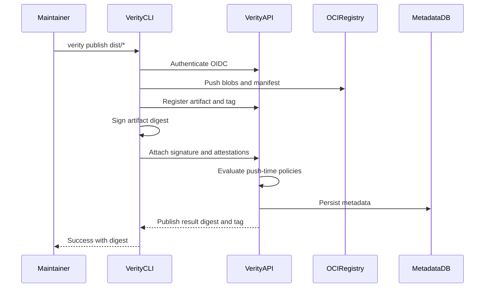
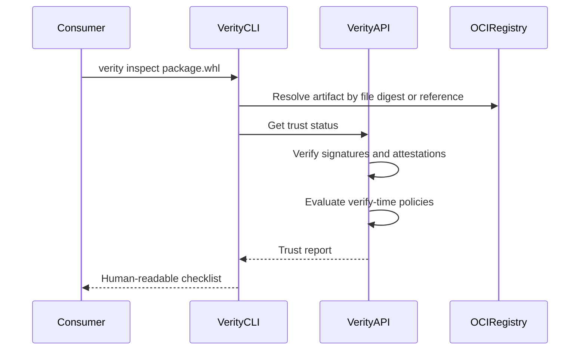

# MVP Overview

## Summary

Verity is an open-source trust platform for publishing, verifying, and governing software artifacts. The MVP is delivered in **layers** so each release makes honest security claims:

| Layer | Theme | Focus |
|-------|--------|--------|
| **A — Integrity** | v0.1 | OCI digests, Sigstore signatures, `require-signatures`, `publish` / `inspect` |
| **B — Attribution** | v0.2 | Provenance verify on inspect, GitHub Actions golden path, honest trust reports |
| **C — Governance** | v0.3+ | Consumer `login`/`pull`, digest-pin UX, webhooks, optional GitHub API ownership depth |

This document defines MVP boundaries, reconciles README roadmap phasing with MVP scope, and links to feature and foundation specs.

## Goals

- Make software releases verifiable by default for open-source maintainers.
- Provide OCI-native artifact publishing with immutable digests and semver tagging.
- Integrate Sigstore keyless signing and verification into publish and inspect flows.
- Persist metadata required for provenance, policy, and trust status aggregation.
- Deliver a CLI and GitHub Actions path that matches the [README example workflow](../../README.md#example-workflow).

## Non-goals

The MVP intentionally excludes (see also [README non-goals](../../README.md#non-goals-initial-mvp)):

- Enterprise RBAC complexity
- Multi-region replication
- Billing and multi-tenancy
- Ecosystem parity with Artifactory or full PyPI/npm proxy behavior
- Advanced package search
- Kubernetes operators
- Proprietary extensions
- Federation, transparency logs, and reproducible-build verification (Phase 3)
- Ecosystem adapters (PyPI/npm mirrors) (Phase 3)

## Personas

| Persona | Description |
|---------|-------------|
| **Maintainer** | Publishes release artifacts from GitHub Actions or locally; cares that signing and provenance are automatic. |
| **Consumer** | Downloads artifacts and runs `verity inspect` (or CI verify) before trusting an artifact. |
| **Operator** | Deploys Verity API, registry, and database; configures namespace-level policies and trusted publishers. |

## MVP delivery matrix

The [README MVP scope](../../README.md#mvp-scope) lists features that the [roadmap](../../README.md#roadmap) spreads across Phase 1–3. The matrix below is the **authoritative phasing** for specifications and acceptance testing.

| Capability | Must | Should | Deferred |
|------------|:----:|:------:|:--------:|
| OCI artifact push/pull | ✓ | | |
| Immutable content digests | ✓ | | |
| Semantic version tagging | ✓ | | |
| Metadata persistence (PostgreSQL) | ✓ | | |
| Verity API (core resources) | ✓ | | |
| Sigstore keyless signing | ✓ | | |
| Signature verification | ✓ | | |
| CLI `publish` and `inspect` | ✓ | | |
| Policy: require signatures | ✓ | | |
| Policy: trusted publishers (when rule configured) | ✓ | | |
| Honest inspect (no ✓ for unevaluated checks) | ✓ | | |
| SLSA-style provenance attestations | | ✓ | |
| Source repo + commit linkage | | ✓ | |
| CI workflow identity in provenance | | ✓ | |
| SBOM attachment | | ✓ | |
| Provenance verification on inspect | | ✓ | |
| GitHub Actions integration (production golden path) | | ✓ | |
| Policy: repository ownership (when rule configured) | | ✓ | |
| Push-time enforcement for all configured policies on `SetTag` | | ✓ | |
| Policy: block critical CVEs | | | ✓ |
| Full vulnerability database integration | | | ✓ |
| Transparency log / Rekor UI | | | ✓ |
| Federation | | | ✓ |
| Ecosystem adapters | | | ✓ |

**Phase mapping (informative):**

- **Phase 1 / Layer A (v0.1):** Integrity Must items.
- **Phase 2 / Layer B (v0.2):** Attribution Should items (provenance verify, GHA golden path).
- **Phase 3 / Layer C (v0.3):** Consumer DX, webhooks, digest-pin policy, GitHub API ownership option; deferred CVE/federation items.

Feature specs tag each functional requirement with **Must**, **Should**, or **Deferred** per this matrix.

**Configured policies (Option A):** When an operator adds a policy rule to a namespace document, evaluation of that rule is **fail-closed** (hard failure, non-zero inspect exit, no warn-only mode). Rules not present in the policy are not evaluated. See [04-policy-enforcement.md](04-policy-enforcement.md#trusted-publishers).

## End-to-end flows

### Publish flow



**Automatic behaviors** (per README): sign artifacts, generate provenance (Should), upload metadata, attach attestations (Should), publish to OCI storage.

### Inspect / verify flow



**Example inspect output** (Layer B target; lines use `✓` only when that check was evaluated and passed):

```text
✓ Signed by GitHub Actions
✓ Publisher allowed (trusted-publishers)
— Repository verified (repository-ownership not configured)
⚠ SBOM not attached
✓ Provenance verified
```

Use `—` or omit lines for checks that were not configured. Do not show `✓` for stored-but-unverified attestations.

## User stories

| ID | Priority | Story |
|----|----------|-------|
| US-OV-001 | Must | As a maintainer, I want to publish signed artifacts with one command so that consumers can verify integrity before use. |
| US-OV-002 | Must | As a consumer, I want to inspect an artifact and see which checks were evaluated and passed so that I can decide whether to use it. |
| US-OV-003 | Should | As a maintainer, I want GitHub Actions to publish and sign automatically so that I do not manage long-lived keys (production golden path). |
| US-OV-004 | Must | As an operator, I want to require signatures for a namespace so that unsigned artifacts cannot be tagged. |
| US-OV-005 | Must | As an operator, I want to allow only configured signing identities (trusted publishers) so that signatures from other workflows fail when I enable that policy. |
| US-OV-006 | Must | As a consumer, I want inspect output to distinguish verified, failed, and not-configured checks so that I am not misled by decorative metadata. |

## Functional requirements

| ID | Priority | Requirement |
|----|----------|-------------|
| FR-OV-001 | Must | The system SHALL distribute artifacts via an OCI Distribution-compatible registry. |
| FR-OV-002 | Must | The system SHALL address artifacts by immutable digest. |
| FR-OV-003 | Must | The system SHALL support semantic version tags that resolve to a digest at inspect/pull time. |
| FR-OV-004 | Must | The system SHALL verify cryptographic signatures using Sigstore-compatible tooling. |
| FR-OV-005 | Must | The system SHALL expose a Verity API for artifact registration, trust status, and policy evaluation. |
| FR-OV-006 | Must | The system SHALL provide a CLI with `publish` and `inspect` commands. |
| FR-OV-007 | Should | The system SHALL generate or accept SLSA-style provenance attestations bound to artifact digests. |
| FR-OV-008 | Should | The system SHALL support GitHub Actions as a first-class publish and sign path. |
| FR-OV-009 | Should | The system SHALL evaluate configurable policies at publish and verify time. |
| FR-OV-010 | Deferred | The system MAY block artifacts with known critical CVEs via policy (requires vulnerability data source). |

## Non-functional requirements

| ID | Requirement |
|----|-------------|
| NFR-OV-001 | MVP deployments SHALL target single-region, single-tenant OSS operator scenarios. |
| NFR-OV-002 | Trust verification failures SHALL produce actionable messages naming the failed check and remediation hint. |
| NFR-OV-003 | The platform SHALL build on open standards (OCI, Sigstore, SLSA, in-toto) rather than proprietary formats. |
| NFR-OV-004 | Long-lived signing keys SHALL NOT be required for the primary GitHub Actions workflow (keyless preferred). |
| NFR-OV-005 | Trust reports SHALL distinguish **verified**, **failed**, and **not configured** for each line; SHALL NOT show `✓` for checks that were not evaluated. |
| NFR-OV-006 | `--skip-sign`, `--skip-provenance`, and `VERITY_DEV_TOKEN` SHALL be documented and supported for **local development only**; production release workflows SHALL NOT use them. |

## Standards and references

- [OCI Distribution Spec](https://github.com/opencontainers/distribution-spec)
- [Sigstore documentation](https://docs.sigstore.dev/)
- [SLSA](https://slsa.dev/)
- [README](../../README.md) — product vision and example workflow

## Dependencies

Foundation and feature specs:

- [architecture.md](architecture.md)
- [metadata-model.md](metadata-model.md)
- [api.md](api.md)
- [01-artifact-publishing.md](01-artifact-publishing.md) through [05-developer-experience.md](05-developer-experience.md)

## Acceptance criteria

| ID | Criterion | Maps to |
|----|-----------|---------|
| AC-OV-001 | Given a configured Verity instance, when a maintainer runs `verity publish` on build outputs, then artifacts are stored in OCI with a stable digest and semver tag. | FR-OV-001, FR-OV-002, FR-OV-003, FR-OV-006 |
| AC-OV-002 | Given a published signed artifact, when a consumer runs `verity inspect`, then signature validity is reported and unsigned artifacts fail when require-signature policy is enabled. | FR-OV-004, FR-OV-006 |
| AC-OV-003 | Given Phase 2 capabilities enabled, when inspecting a fully attested artifact, then inspect output includes provenance and SBOM lines per README example. | FR-OV-007, FR-OV-009 |
| AC-OV-004 | Given all Must requirements implemented, when tracing README Phase 1 roadmap items, then each Phase 1 bullet has corresponding passing acceptance tests. | Delivery matrix |
| AC-OV-005 | Given `trusted-publishers` configured with a non-empty allowlist, when inspect runs on a digest signed by a non-allowlisted workflow, then evaluation fails with `POLICY_FAILED` and non-zero CLI exit. | FR-POL-006, US-OV-005 |
| AC-OV-006 | Given inspect on an artifact, when a check was not configured in policy, then output does not show `✓` for that check (uses `—`, `⚠`, or omits the line). | NFR-OV-005, US-OV-006 |

## Cross-spec open questions

| ID | Question | Related specs |
|----|----------|---------------|
| OQ-OV-001 | Push-time vs verify-time for policies not yet on `SetTag`? | [04-policy-enforcement.md](04-policy-enforcement.md) — resolved for enabled rules; push-time gap tracked to Layer C |
| OQ-OV-002 | Minimum SLSA build level targeted for MVP provenance? | [03-provenance-metadata.md](03-provenance-metadata.md) (OQ-PROV-001) |
| OQ-OV-003 | Is SBOM required on publish or optional with warn-on-missing? | [03-provenance-metadata.md](03-provenance-metadata.md) (OQ-PROV-002) |
| OQ-OV-004 | SPDX vs CycloneDX as the MVP SBOM format (or support both)? | [03-provenance-metadata.md](03-provenance-metadata.md) (OQ-PROV-003) |
| OQ-OV-005 | Does Verity wrap an existing registry or embed OCI Distribution? | [architecture.md](architecture.md) (OQ-ARCH-001), [api.md](api.md) |
| OQ-ARCH-002 | Should CLI verify signatures locally always, or trust API trust-status by default? | [architecture.md](architecture.md), [02-signing-verification.md](02-signing-verification.md) |
| OQ-META-001 | Use OCI referrers API vs custom attestation attachment layout? | [metadata-model.md](metadata-model.md) |
| OQ-META-002 | Store Sigstore bundle only in DB vs also as OCI artifact layer? | [metadata-model.md](metadata-model.md), [02-signing-verification.md](02-signing-verification.md) |
| OQ-API-001 | REST path layout convention? | [api.md](api.md) |
| OQ-API-002 | Support API keys for local dev in addition to OIDC? | [api.md](api.md) |
| OQ-PUB-002 | Maximum artifact size limits for MVP? | [01-artifact-publishing.md](01-artifact-publishing.md) |
| OQ-SIGN-001 | Pin Sigstore public good vs self-hosted? | [02-signing-verification.md](02-signing-verification.md) |
| OQ-SIGN-002 | Allow cosign attach-signatures vs integrated sign-only? | [02-signing-verification.md](02-signing-verification.md) |
| OQ-PROV-004 | Repository ownership via GitHub API vs provenance claim only? | [03-provenance-metadata.md](03-provenance-metadata.md), [04-policy-enforcement.md](04-policy-enforcement.md) |
| OQ-DX-001 | Monolithic `verity` binary vs separate CLI and server? | [05-developer-experience.md](05-developer-experience.md) |
| OQ-DX-002 | Default config file path? | [05-developer-experience.md](05-developer-experience.md) |

## Resolved open questions

| ID | Question | Resolution |
|----|----------|------------|
| OQ-PUB-001 | OCI artifact media type for generic packages? | [ADR-0001](../adr/0001-artifact-manifest-layout.md) — OCI Artifact manifest; see [01-artifact-publishing.md](01-artifact-publishing.md#resolved-open-questions). |
| OQ-POL-002 | Warn vs fail for configured policies? | **Resolved:** configured rules always fail closed (Option A). See [04-policy-enforcement.md](04-policy-enforcement.md#resolved-open-questions). |

## Open questions

Spec-specific open questions are listed in each document; the table above is the consolidated index for cross-review.
