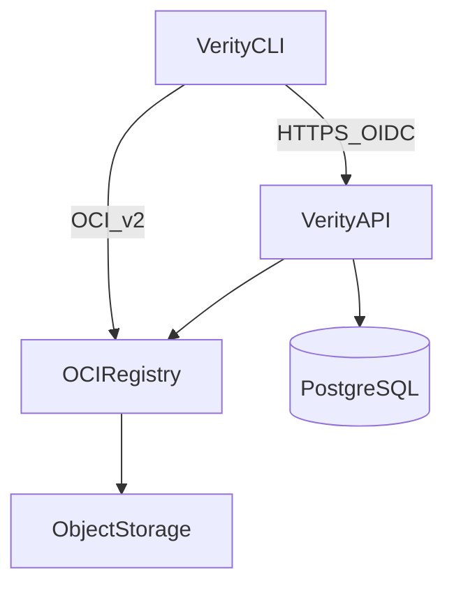

# System Architecture

## Summary

Verity comprises a CLI, HTTP API, OCI-compatible registry, PostgreSQL metadata store, and S3-compatible object storage. The API orchestrates trust operations (registration, attestations, policy, trust status) while the registry stores immutable artifact content. This spec defines logical components, trust boundaries, and deployment assumptions for the MVP.

See [00-overview.md](00-overview.md) for MVP scope and delivery matrix.

## Goals

- Clearly separate content distribution (OCI) from trust metadata and policy (Verity API + DB).
- Define where verification runs (client, API, or both) for MVP.
- Document trust boundaries for keys, identities, and untrusted inputs.
- Support single-region OSS operator deployments without multi-tenancy complexity.

## Non-goals

- Detailed network topology, Kubernetes manifests, or cloud-specific IaC.
- Multi-region replication and active-active registry design.
- Enterprise RBAC and organization hierarchy modeling.
- Reimplementing the full OCI Distribution API when proxying or embedding is sufficient (see [api.md](api.md)).

## Personas

| Persona | Architectural concern |
|---------|----------------------|
| **Maintainer** | Reliable publish path from CI through API to registry. |
| **Consumer** | Verify without trusting the registry alone (signatures and attestations). |
| **Operator** | Operate API, DB, registry backend, and object storage with clear security boundaries. |

## Logical component diagram

```text
                +-------------------+
                | Verity CLI        |
                +-------------------+
                         |
                         | HTTPS (OIDC bearer)
                         v
                +-------------------+
                | Verity API        |
                +-------------------+
                    |          |
         OCI push/pull         | SQL
                    |          v
                    v    +----------------+
           +-------------+   | Metadata DB  |
           | OCI Registry|   | (PostgreSQL) |
           +-------------+   +----------------+
                    |
                    | blob storage
                    v
           +------------------+
           | Object Storage   |
           | (S3-compatible)  |
           +------------------+
```



## Component responsibilities

| Component | Responsibility |
|-----------|----------------|
| **Verity CLI** | User-facing publish, inspect, and auth; OCI push/pull; invokes signing; calls Verity API for metadata and trust. |
| **Verity API** | Artifact and tag registration; attestation and signature indexing; policy storage and evaluation; trust status aggregation; audit events. |
| **OCI Registry** | Content-addressed blob and manifest storage per OCI Distribution Spec. |
| **Metadata DB** | Queryable trust and release metadata, policies, publisher allowlists, tag-to-digest mappings. |
| **Object Storage** | Durable blob backend for registry (when not using local filesystem). |

## Trust boundaries

| Boundary | Trusted side | Untrusted / verified side |
|----------|--------------|---------------------------|
| Registry content | Digest integrity via hash | Manifest claims without signature |
| Verity API | Authenticated operators for policy writes | Anonymous writes; all publish paths require auth |
| CLI ↔ API | TLS + OIDC token validation | Client-supplied provenance JSON (must be validated and signed) |
| Sigstore | Fulcio/Rekor as trust roots (configurable) | Signatures without valid certificate chain |
| Consumer | Local verify after fetching public roots | Inspect output alone without re-verification option |

**Verification placement (MVP default):**

- **Signature and attestation cryptographic verification:** CLI MAY verify locally; API MUST verify when serving trust status (defense in depth).
- **Policy evaluation:** API is authoritative for push-time gates; CLI displays API trust report on inspect.

## User stories

| ID | Story |
|----|-------|
| US-ARCH-001 | As an operator, I want registry blobs isolated from the metadata DB so that I can scale storage independently. |
| US-ARCH-002 | As a consumer, I want verification to depend on signatures and attestations, not only registry access control. |
| US-ARCH-003 | As a maintainer, I want CI to authenticate with OIDC so that no long-lived secrets are stored in the repository. |

## Functional requirements

| ID | Priority | Requirement |
|----|----------|-------------|
| FR-ARCH-001 | Must | The Verity API SHALL be the only component that mutates policy and publisher configuration in the metadata DB. |
| FR-ARCH-002 | Must | Artifact blobs and manifests SHALL be stored in an OCI Distribution-compatible registry backed by durable object storage or equivalent. |
| FR-ARCH-003 | Must | The CLI SHALL communicate with the Verity API over HTTPS with OIDC bearer authentication for protected operations. |
| FR-ARCH-004 | Must | The system SHALL NOT require consumers to trust registry operators alone; signature verification SHALL be available on inspect. |
| FR-ARCH-005 | Should | The Verity API SHALL emit audit events for publish, policy change, and failed policy evaluations. |
| FR-ARCH-006 | Should | GitHub Actions workflows SHALL obtain OIDC tokens from GitHub and present them to the Verity API and Sigstore. |

## Non-functional requirements

| ID | Requirement |
|----|-------------|
| NFR-ARCH-001 | MVP deployments SHALL run in a single geographic region. |
| NFR-ARCH-002 | Secrets (DB credentials, registry credentials) SHALL NOT be stored in artifact metadata or attestations. |
| NFR-ARCH-003 | The API SHALL fail closed on authentication and push-time policy failures. |
| NFR-ARCH-004 | Components SHALL be operable with health endpoints suitable for load balancer checks (API and registry). |

## Deployment assumptions (MVP)

| Assumption | Detail |
|------------|--------|
| Tenancy | Single-tenant or few namespaces per instance; no billing isolation. |
| Registry | Embedded OCI Distribution or managed registry with Verity as control plane (see OQ-OV-005). |
| Database | PostgreSQL with backups left to operator. |
| Identity | GitHub OIDC for CI; other OIDC providers Deferred unless needed for local dev. |
| Availability | Best-effort HA not required for MVP; recovery via DB and registry backup. |

## Standards and references

- [OCI Distribution Spec](https://github.com/opencontainers/distribution-spec)
- [00-overview.md](00-overview.md)
- [metadata-model.md](metadata-model.md)

## Dependencies

- [metadata-model.md](metadata-model.md) — storage placement
- [api.md](api.md) — API surface
- Feature specs 01–05

## Acceptance criteria

| ID | Criterion | Maps to |
|----|-----------|---------|
| AC-ARCH-001 | Given an operator deployment, when inspecting component connectivity, then CLI reaches API and registry, API reaches DB and registry, registry reaches object storage. | FR-ARCH-002, FR-ARCH-003 |
| AC-ARCH-002 | Given an unsigned artifact and require-signature policy, when publish is attempted, then API rejects before tag is advertised as trusted. | FR-ARCH-001, FR-ARCH-004 |
| AC-ARCH-003 | Given a publish from GitHub Actions, when authentication is traced, then only OIDC-based identity is used for signing (no repo-stored signing key). | FR-ARCH-006, NFR-OV-004 |

## Open questions

| ID | Question |
|----|----------|
| OQ-ARCH-001 | Embed OCI Distribution in Verity API process vs separate registry service? (see OQ-OV-005) |
| OQ-ARCH-002 | Should CLI verify signatures locally always, or trust API trust-status by default? |
