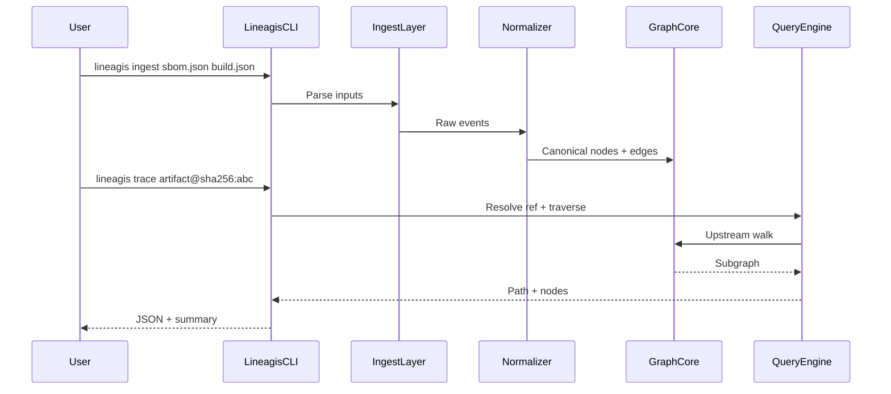

# Lineage Graph Engine — MVP Specification (v1.0)

## Spec summary (agent index)


| Section                                         | Key points                                                                    |
| ----------------------------------------------- | ----------------------------------------------------------------------------- |
| [Objective](#objective)                         | In-memory provenance DAG; CLI ingest + trace + why; deterministic JSON output |
| [Agent context](#agent-context)                 | Commands, tests, layout, style, git workflow, boundaries                      |
| [Delivery matrix](#delivery-matrix)             | v1.0 Must / v1.1 Should / v1.2+ Deferred                                      |
| [Data model](#data-model)                       | 4 node types, 3 edge types (v1.0); canonical IDs                              |
| [Implementation phases](#implementation-phases) | Build one phase at a time; do not skip graph core                             |
| [Requirements](#functional-requirements)        | `FR-LIN-*`, `AC-LIN-*` with Must/Should/Deferred tags                         |
| [Conformance](#conformance-fixtures)            | YAML fixtures agents must pass before marking done                            |


**Authoritative design inputs:** [lineagis_design.md](../lineagis_design.md), [lineagis_architecture_overview.md](../lineagis_architecture_overview.md).

**Relationship to v0.3:** The shipped trust platform (OCI publish, Sigstore, policy) remains documented in [00-overview.md](00-overview.md). v1.0 lineage engine is a **new CLI-first graph layer** that can later ingest v0.3 metadata as a source (v1.1+). Do not conflate the two products in one implementation task.

---

## Objective

Build the **v1.0 lineage graph MVP**: a deterministic, in-memory directed acyclic graph (DAG) that connects commits, builds, artifacts, and dependencies, exposed through a developer-first CLI.

**Success looks like:**

1. A maintainer ingests a CycloneDX or SPDX SBOM plus optional git/build metadata.
2. The tool materializes a canonical provenance graph with stable node IDs.
3. Running `lineagis trace` walks upstream from an artifact to root commits.
4. Running `lineagis why` explains the path and missing links in human-readable form.
5. Output is identical for identical inputs (JSON + summary; optional Graphviz).

**Primary primitive:** traceability — not signing, not policy, not publishing.

---

## Agent context

### Commands


| Action                                                        | Command                                                                                    |
| ------------------------------------------------------------- | ------------------------------------------------------------------------------------------ |
| Build CLI + API (existing stack)                              | `make build`                                                                               |
| Unit tests                                                    | `make test`                                                                                |
| Integration tests                                             | `make test-integration`                                                                    |
| Lint                                                          | `make lint`                                                                                |
| Local stack (v0.3 API; not required for v1.0 graph-only work) | `make compose-up`                                                                          |
| Run lineage CLI (after implementation)                        | `./bin/lineagis ingest <file>` · `./bin/lineagis trace <ref>` · `./bin/lineagis why <ref>` |
| Graph-only tests (target)                                     | `go test ./internal/core/... ./internal/ingest/... ./internal/normalize/...`               |


### Testing


| Topic                | Rule                                                                                                                                     |
| -------------------- | ---------------------------------------------------------------------------------------------------------------------------------------- |
| Framework            | Go `testing` package; table-driven tests preferred                                                                                       |
| Unit test location   | Co-located `*_test.go` beside source                                                                                                     |
| Integration tests    | `//go:build integration` tag; run via `make test-integration`                                                                            |
| Graph conformance    | Pass all cases in [conformance fixtures](#conformance-fixtures) before marking a phase done                                              |
| Coverage expectation | New packages (`internal/core/`*, `internal/ingest/sbom`, etc.) must have tests for graph invariants, ID normalization, and query results |
| Self-check           | After implementing, compare output against spec AC-LIN items; list any unmet requirements in the PR description                          |


### Project structure

**Target layout for v1.0** (may coexist with existing v0.3 packages):

```text
cmd/lineagis/                  # CLI entrypoint (extend with ingest/trace/why subcommands)
internal/
  core/
    graph/                     # In-memory DAG: nodes, edges, cycle detection
    model/                     # Commit, Build, Artifact, Dependency types
    engine/                    # Lineage reasoning (path assembly, gap detection)
    query/                     # trace, why executors
  ingest/
    sbom/                      # CycloneDX + SPDX parsers
    git/                       # Commit metadata from repo or JSON sidecar
    artifact/                  # Hash/image/package descriptors
  normalize/
    mapper/                    # External format → canonical model
    dedupe/                    # Event deduplication
    resolver/                  # Hash/tag/commit identity resolution
  storage/
    memory/                    # MVP in-memory store (only backend for v1.0)
examples/
  sbom-cyclonedx.json          # Conformance input
  sbom-spdx.json
  sample-graph.json            # Expected graph snapshot
tests/
  lineage/                     # Cross-package integration tests
  conformance/                 # YAML-driven ingest/trace/why fixtures
docs/specs/
  lineage-engine-mvp.md        # This document
```

**Boundaries for file placement:**

- Graph logic → `internal/core/` only (no SBOM parsing in `graph/`)
- Format parsers → `internal/ingest/<source>/`
- CLI wiring → `cmd/lineagis/` (thin; delegate to `internal/core/query`)

### Code style

Match existing Go conventions in this repository:

```go
// Canonical node ID format — lowercase type prefix, stable separator.
func ArtifactID(digest string) string {
    return "artifact:" + strings.ToLower(digest)
}

// Errors wrap context; exported APIs document invariants in doc comments.
func (g *Graph) AddEdge(from, to string, edgeType EdgeType) error {
    if g.hasCycle(from, to) {
        return fmt.Errorf("add edge %s -> %s: would create cycle", from, to)
    }
    // ...
}
```


| Convention  | Rule                                                                               |
| ----------- | ---------------------------------------------------------------------------------- |
| Module path | `github.com/BrendenWalker/lineagis`                                                |
| Naming      | `CamelCase` exported; `camelCase` unexported                                       |
| IDs         | `{type}:{canonical-identifier}` (e.g. `commit:abc123`, `artifact:sha256:deadbeef`) |
| Errors      | Wrap with `%w`; CLI prints actionable messages                                     |
| JSON output | Stable key ordering via struct tags; snake_case in JSON field names                |
| Comments    | Only for non-obvious invariants (DAG rules, ID normalization)                      |


### Git workflow


| Topic              | Rule                                                                         |
| ------------------ | ---------------------------------------------------------------------------- |
| Branch (story)     | `story/<id>-<short-slug>` e.g. `story/lin-ingest-sbom`                       |
| Branch (milestone) | `milestone/lineage-v1.0`                                                     |
| Commits            | Only when human requests; imperative subject, optional body explaining *why* |
| PR body            | Linked story, spec refs (`FR-LIN-`*, `AC-LIN-*`), test plan                  |
| CI gate            | `make test` and `make lint` must pass before review                          |
| Push / merge       | Human approval required; agent must not push or merge                        |


### Boundaries

**Always**

- Run `go test ./...` (or affected packages) before marking work complete.
- Preserve DAG integrity: reject edges that introduce cycles.
- Normalize artifact IDs to lowercase digest form (`sha256:…`).
- Produce deterministic query output for identical graph state.
- Follow existing `cmd/lineagis` switch-based subcommand and manual flag parsing when adding CLI commands.
- Keep v1.0 graph engine **offline-capable** (no API dependency for ingest/trace/why).

**Ask first**

- Adding new third-party dependencies (SBOM parsers, graph libraries).
- Changing canonical ID format (breaks fixture compatibility).
- Modifying v0.3 publish/inspect behavior to feed the graph.
- Database or persistent storage schema (v1.1 scope).
- Renaming or removing existing CLI commands (`publish`, `inspect`, etc.).

**Never**

- Commit secrets, `.env`, or tokens.
- Disable or skip failing tests without explicit human approval.
- Store graph state only in CLI globals without going through `storage/memory`.
- Allow silent deduplication that merges distinct artifacts with different digests.
- Implement v1.1+ features (CI ingestion, persistence, impact/upstream/downstream) under v1.0 tasks.

---

## Summary

Lineagis v1.0 introduces a **lineage graph engine**: ingest heterogeneous supply-chain signals, normalize them into a typed DAG, and query ancestry with `trace` and `why`. Storage is in-memory for MVP. The CLI is the sole user interface; REST/GraphQL and dashboards are deferred.

This spec defines v1.0 Must requirements and previews v1.1/v1.2 Should/Deferred items so agents can scope tasks without reading the full design doc.

## Goals

- Unify SBOM, git, and build-artifact signals into one queryable provenance graph.
- Trace artifact ancestry upstream to source commits in one command.
- Explain lineage gaps ("why is this node orphaned?") with actionable output.
- Guarantee deterministic outputs: same inputs → same graph → same query results.
- Lay foundation for v1.1 multi-source ingestion without rewriting the core model.

## Non-goals

v1.0 explicitly excludes:

- Persistent graph storage (Postgres, Neo4j) — v1.1+
- CI/CD live ingestion (GitHub Actions, GitLab) — v1.1
- Container registry polling — v1.1
- `impact`, `upstream`, `downstream` commands — v1.2
- HTML dashboard or GraphQL API — v2+
- Signature verification and policy enforcement — owned by [00-overview.md](00-overview.md) trust platform
- Anomaly detection and alerting — v1.1+
- Multi-repo federated graphs — v2.3+
- Deployment nodes in the default ingest path — Should for v1.0, full automation Deferred

## Personas


| Persona               | Description                                                                                       |
| --------------------- | ------------------------------------------------------------------------------------------------- |
| **Maintainer**        | Builds software, produces SBOMs, wants to see commit → artifact linkage locally.                  |
| **Security engineer** | Investigates artifact provenance; needs JSON for automation and readable summaries for triage.    |
| **Operator**          | Runs Lineagis in CI to validate lineage completeness before release (v1.1+); v1.0 uses local CLI. |
| **Agent implementer** | AI or human developer implementing one [implementation phase](#implementation-phases) at a time.  |


## Delivery matrix


| Capability                                             | v1.0 Must | v1.1 Should | v1.2+ Deferred |
| ------------------------------------------------------ | --------- | ----------- | -------------- |
| In-memory DAG store                                    | ✓         |             |                |
| Node types: commit, build, artifact, dependency        | ✓         |             |                |
| Edge types: `produced_by`, `built_from`, `depends_on`  | ✓         |             |                |
| CycloneDX SBOM ingest                                  | ✓         |             |                |
| SPDX SBOM ingest                                       | ✓         |             |                |
| Git commit metadata ingest (JSON sidecar or `git` CLI) | ✓         |             |                |
| Build artifact descriptor ingest (hash/name)           | ✓         |             |                |
| Identity normalization and dedupe                      | ✓         |             |                |
| DAG cycle rejection                                    | ✓         |             |                |
| CLI `ingest`                                           | ✓         |             |                |
| CLI `trace`                                            | ✓         |             |                |
| CLI `why`                                              | ✓         |             |                |
| JSON + human-readable output                           | ✓         |             |                |
| Graphviz DOT output (`visualize`)                      |           | ✓           |                |
| Basic verification (missing nodes, broken chains)      | ✓         |             |                |
| GitHub Actions / GitLab CI ingestion                   |           | ✓           |                |
| Container registry ingestion                           |           | ✓           |                |
| Incremental persistence (Postgres)                     |           | ✓           |                |
| Anomaly detection (missing/unexpected deps)            |           | ✓           |                |
| Edge types: `deployed_to`, `derived_from`              |           | ✓           |                |
| Deployment node automation                             |           |             | ✓              |
| CLI `impact`, `upstream`, `downstream`                 |           |             | ✓              |
| Sigstore attestation ingest                            |           |             | ✓              |
| REST/GraphQL API                                       |           |             | ✓              |
| Web UI                                                 |           |             | ✓              |


## Data model

### Node types (v1.0)


| Type         | ID pattern                                | Required metadata                                                    |
| ------------ | ----------------------------------------- | -------------------------------------------------------------------- |
| `commit`     | `commit:{sha}`                            | `repo`, `sha`; optional `author`, `timestamp`                        |
| `build`      | `build:{id}`                              | `system`, `pipeline`; optional `status`, `timestamp`                 |
| `artifact`   | `artifact:sha256:{hex}`                   | `digest`, `name`; optional `type` (container-image, package, binary) |
| `dependency` | `dependency:{ecosystem}:{name}@{version}` | `ecosystem`, `name`, `version`                                       |


### Edge types (v1.0)


| Edge          | Direction             | Semantics                     |
| ------------- | --------------------- | ----------------------------- |
| `produced_by` | artifact → build      | Build output this artifact    |
| `built_from`  | build → commit        | Source revision for build     |
| `depends_on`  | artifact → dependency | Direct dependency of artifact |


Edge direction for queries: **upstream** walks against edge direction toward commits; **downstream** (v1.2) walks with edge direction.

### Graph invariants

1. **DAG:** The provenance subgraph containing `built_from`, `produced_by`, and `derived_from` edges must remain acyclic. `depends_on` edges may form cycles only among dependency nodes, not among commit/build/artifact nodes.
2. **Immutable edges:** Append-only; no in-place mutation of existing edges.
3. **Canonical IDs:** Same real-world entity resolves to the same node ID (case-normalized digests, trimmed refs).
4. **Determinism:** Ingest order must not change final graph topology when events describe the same facts.

### Reference examples

Commit node:

```json
{
  "id": "commit:abc123def",
  "type": "commit",
  "metadata": {
    "repo": "org/service",
    "sha": "abc123def",
    "author": "dev@example.com",
    "timestamp": "2026-05-31T12:00:00Z"
  }
}
```

Edge:

```json
{
  "from": "artifact:sha256:deadbeef",
  "to": "build:ci-run-789",
  "type": "produced_by",
  "metadata": {
    "timestamp": "2026-05-31T12:05:00Z"
  }
}
```

## User stories


| ID         | Priority | Story                                                                                                           |
| ---------- | -------- | --------------------------------------------------------------------------------------------------------------- |
| US-LIN-001 | Must     | As a maintainer, I want to ingest an SBOM file so that dependencies appear as nodes linked to my artifact.      |
| US-LIN-002 | Must     | As a maintainer, I want to attach git commit and build metadata so that trace reaches source control.           |
| US-LIN-003 | Must     | As a security engineer, I want to trace an artifact upstream so that I see the commit → build → artifact chain. |
| US-LIN-004 | Must     | As a security engineer, I want `why` to explain missing links so that I know what data to collect next.         |
| US-LIN-005 | Must     | As an operator, I want JSON output so that CI can gate on lineage completeness.                                 |
| US-LIN-006 | Should   | As a maintainer, I want Graphviz output so that I can visualize the DAG in reviews.                             |
| US-LIN-007 | Should   | As a security engineer, I want basic verification reports so that orphaned artifacts are flagged.               |
| US-LIN-008 | Deferred | As a release manager, I want `impact` for a commit so that I see affected artifacts (v1.2).                     |


## Functional requirements

### Ingestion and normalization


| ID         | Priority | Requirement                                                                                                  |
| ---------- | -------- | ------------------------------------------------------------------------------------------------------------ |
| FR-LIN-001 | Must     | The system SHALL parse CycloneDX JSON (≥1.4) and emit artifact and dependency nodes with `depends_on` edges. |
| FR-LIN-002 | Must     | The system SHALL parse SPDX JSON (≥2.2) and emit equivalent artifact and dependency nodes.                   |
| FR-LIN-003 | Must     | The system SHALL accept git commit metadata via JSON sidecar or local `git` repository path.                 |
| FR-LIN-004 | Must     | The system SHALL accept build descriptors linking a build ID to a commit and one or more artifact digests.   |
| FR-LIN-005 | Must     | The normalizer SHALL deduplicate nodes by canonical ID across multiple ingest calls in one session.          |
| FR-LIN-006 | Must     | The normalizer SHALL resolve artifact references (name@tag, digest) to a single canonical artifact node ID.  |


### Graph core


| ID         | Priority | Requirement                                                                                       |
| ---------- | -------- | ------------------------------------------------------------------------------------------------- |
| FR-LIN-010 | Must     | The graph store SHALL maintain typed nodes and directed edges with metadata.                      |
| FR-LIN-011 | Must     | The graph store SHALL reject `built_from` / `produced_by` edges that introduce a cycle.           |
| FR-LIN-012 | Must     | The graph store SHALL support listing nodes by type and fetching neighbors filtered by edge type. |
| FR-LIN-013 | Must     | The graph store SHALL be held in memory for v1.0 (no external DB).                                |


### Query engine


| ID         | Priority | Requirement                                                                                                                                                |
| ---------- | -------- | ---------------------------------------------------------------------------------------------------------------------------------------------------------- |
| FR-LIN-020 | Must     | `trace` SHALL perform upstream traversal from a given artifact or dependency ref to reachable commits, ordered deterministically (stable sort by node ID). |
| FR-LIN-021 | Must     | `why` SHALL return the shortest upstream path when one exists, or enumerate missing edge types when the chain is broken.                                   |
| FR-LIN-022 | Must     | Query results SHALL include node summaries and traversed edges sufficient to reproduce the path programmatically.                                          |
| FR-LIN-023 | Should   | `visualize` SHALL emit Graphviz DOT for the subgraph reachable from the query root.                                                                        |


### Verification layer


| ID         | Priority | Requirement                                                                                                             |
| ---------- | -------- | ----------------------------------------------------------------------------------------------------------------------- |
| FR-LIN-030 | Must     | The system SHALL detect artifacts with no `produced_by` edge and include them in verification output.                   |
| FR-LIN-031 | Must     | The system SHALL detect builds with no `built_from` commit and report them as incomplete lineage.                       |
| FR-LIN-032 | Should   | The system SHALL detect dependency nodes reachable only via `depends_on` with no linking artifact (unexpected orphans). |


### CLI and output


| ID         | Priority | Requirement                                                                                           |
| ---------- | -------- | ----------------------------------------------------------------------------------------------------- |
| FR-LIN-040 | Must     | The CLI SHALL provide `lineagis ingest <path>` accepting `.json` SBOM and sidecar files.              |
| FR-LIN-041 | Must     | The CLI SHALL provide `lineagis trace <ref>` where `<ref>` is `artifact@sha256:…` or `artifact:<id>`. |
| FR-LIN-042 | Must     | The CLI SHALL provide `lineagis why <ref>` with human-readable explanation.                           |
| FR-LIN-043 | Must     | Default output SHALL include JSON (stdout or `--format json`) and a concise human summary.            |
| FR-LIN-044 | Must     | Exit code SHALL be non-zero when the target node is not found or `why` identifies a broken chain.     |
| FR-LIN-045 | Should   | The CLI SHALL provide `lineagis visualize <ref> --format dot` for Graphviz.                           |


## Non-functional requirements


| ID          | Requirement                                                                                                                                |
| ----------- | ------------------------------------------------------------------------------------------------------------------------------------------ |
| NFR-LIN-001 | Ingest + trace of a 500-component SBOM SHALL complete in <5s on a developer laptop (informative target).                                   |
| NFR-LIN-002 | Memory use SHALL scale linearly with node and edge count; no unbounded caches across CLI invocations.                                      |
| NFR-LIN-003 | JSON output schemas SHALL be documented in `docs/specs/lineage-engine-mvp.md` or a linked schema file and versioned with `schema_version`. |
| NFR-LIN-004 | The engine SHALL not require network access for v1.0 ingest/trace/why (offline-first).                                                     |
| NFR-LIN-005 | Error messages SHALL name the missing edge type or unknown ref and suggest a remediation (e.g. "ingest build metadata with built_from").   |
| NFR-LIN-006 | Same input files ingested in any order SHALL produce identical graph adjacency for the same semantic content.                              |


## Standards and references

- [CycloneDX JSON](https://cyclonedx.org/docs/1.4/json/)
- [SPDX JSON](https://spdx.github.io/spdx-spec/v2.3/)
- [OCI Distribution Spec](https://github.com/opencontainers/distribution-spec) — digest format for artifacts
- [Design & Roadmap](../lineagis_design.md)
- [Architecture Overview](../lineagis_architecture_overview.md)
- [Trust platform MVP](00-overview.md) — v0.3 scope (orthogonal)

## Dependencies

- [lineagis_design.md](../lineagis_design.md) — product phasing v1.0–v1.2
- [lineagis_architecture_overview.md](../lineagis_architecture_overview.md) — layers, repository layout
- [05-developer-experience.md](05-developer-experience.md) — CLI conventions (extend, do not replace v0.3 commands)

## Implementation phases

Agents SHALL implement **one phase per task/PR** unless a human explicitly approves bundling.


| Phase                             | Scope                                                            | Exit criterion                                      |
| --------------------------------- | ---------------------------------------------------------------- | --------------------------------------------------- |
| **P1 — Graph core**               | `internal/core/graph`, `model`, in-memory store, cycle detection | Unit tests for DAG invariants; AC-LIN-010           |
| **P2 — SBOM ingest**              | CycloneDX + SPDX parsers, `depends_on` edges                     | Conformance: `sbom-cyclonedx`, `sbom-spdx` fixtures |
| **P3 — Git + build ingest**       | Sidecar/git ingest, `built_from`, `produced_by`                  | Conformance: `full-chain` fixture                   |
| **P4 — Query engine**             | `trace`, `why`, deterministic ordering                           | Conformance: `trace-`*, `why-*` fixtures            |
| **P5 — CLI + output**             | Cobra commands, JSON/summary, exit codes                         | AC-LIN-040–044; smoke script                        |
| **P6 — Verification + visualize** | Missing-link detection; optional DOT                             | FR-LIN-030–032, FR-LIN-045                          |


Do not start P5 until P1–P4 have passing tests. Do not pull v1.1 persistence into P1–P6.

## End-to-end flows

### Ingest → trace




### Broken chain → why

Given an artifact with `produced_by` but no `built_from` on its build, `why` returns:

```text
artifact:sha256:abc → build:ci-42 (produced_by)
build:ci-42 — missing built_from → commit
Remediation: ingest build metadata or git commit sidecar linking build:ci-42
```

Exit code: non-zero.

## Acceptance criteria


| ID         | Criterion                                                                                                                                                       | Maps to                             |
| ---------- | --------------------------------------------------------------------------------------------------------------------------------------------------------------- | ----------------------------------- |
| AC-LIN-001 | Given a valid CycloneDX SBOM, when `lineagis ingest` runs, then artifact and dependency nodes exist with `depends_on` edges and stable IDs.                     | FR-LIN-001, FR-LIN-005              |
| AC-LIN-002 | Given a valid SPDX SBOM, when `lineagis ingest` runs, then the graph matches the CycloneDX equivalent for the same component set.                               | FR-LIN-002                          |
| AC-LIN-003 | Given SBOM + build + commit sidecars, when `lineagis trace artifact@sha256:…` runs, then output includes commit → build → artifact path in deterministic order. | FR-LIN-003, FR-LIN-004, FR-LIN-020  |
| AC-LIN-004 | Given an artifact whose build lacks `built_from`, when `lineagis why` runs, then output names the missing edge type and exits non-zero.                         | FR-LIN-021, FR-LIN-044, NFR-LIN-005 |
| AC-LIN-005 | Given the same inputs ingested in different order, when the graph is exported to JSON, then adjacency lists are identical.                                      | NFR-LIN-006, FR-LIN-005             |
| AC-LIN-006 | Given a proposed `built_from` edge that would cycle commits/builds/artifacts, when added, then the graph rejects it with an error.                              | FR-LIN-011                          |
| AC-LIN-007 | Given a complete v1.0 ingest bundle, when verification runs, then no incomplete-lineage findings are reported.                                                  | FR-LIN-030, FR-LIN-031              |
| AC-LIN-008 | Given `--format json`, when trace succeeds, then stdout parses as JSON with `schema_version`, `root`, `nodes`, and `edges` keys.                                | FR-LIN-043, NFR-LIN-003             |
| AC-LIN-010 | Given an empty graph, when ingest adds nodes, then `internal/core/graph` tests pass for add/get/list/neighbors/cycle rejection.                                 | FR-LIN-010–FR-LIN-012               |


## Conformance fixtures

Implement under `tests/conformance/`. Each file drives ingest + query + expected output.

```yaml
# tests/conformance/trace-full-chain.yaml
name: trace-full-chain
ingest:
  - examples/sbom-cyclonedx.json
  - examples/build-sidecar.json
  - examples/commit-sidecar.json
command: trace artifact@sha256:abc123
expect:
  exit_code: 0
  path_contains:
    - commit:def456
    - build:ci-789
    - artifact:sha256:abc123
  json_schema: lineage-trace-v1
```

Agents MUST NOT mark P2–P5 complete until the corresponding fixture passes in CI.

## CLI reference (v1.0 target)

```bash
# Ingest one or more files (SBOM, build sidecar, commit sidecar)
lineagis ingest sbom.json
lineagis ingest sbom.json build.json commit.json

# Trace upstream lineage
lineagis trace artifact@sha256:abc123
lineagis trace artifact@sha256:abc123 --format json

# Explain path or missing links
lineagis why artifact@sha256:abc123

# Optional (Should)
lineagis visualize artifact@sha256:abc123 --format dot > graph.dot
```

### JSON output shape (trace)

```json
{
  "schema_version": "lineage-trace/v1",
  "root": "artifact:sha256:abc123",
  "nodes": [{ "id": "commit:def456", "type": "commit", "metadata": {} }],
  "edges": [{ "from": "artifact:sha256:abc123", "to": "build:ci-789", "type": "produced_by" }],
  "verification": { "complete": true, "findings": [] }
}
```

## Open questions


| ID         | Question                                                                             | Default if unresolved                                                            |
| ---------- | ------------------------------------------------------------------------------------ | -------------------------------------------------------------------------------- |
| OQ-LIN-001 | Single combined ingest session vs persistent graph file between CLI invocations?     | **Resolved:** in-memory store per process; default snapshot `.lineagis/graph.json` with `--graph-in` / `--graph-out` and `LINEAGIS_GRAPH_FILE` |
| OQ-LIN-002 | SPDX vs CycloneDX when both provided for same artifact?                              | **Merge if digests match; error on conflict**                                    |
| OQ-LIN-003 | Use external SBOM library vs minimal custom parser?                                  | **Ask first** before adding dependency                                           |
| OQ-LIN-004 | Coexist `lineagis ingest` graph mode with existing publish subcommand in one binary? | **Yes** — same binary, separate subcommands                                      |
| OQ-LIN-005 | Minimum CycloneDX/SPDX fields required to create artifact node?                      | **Name + version or purl + at least one hash**                                   |


## Agent self-check (before PR)

1. List each `FR-LIN-`* addressed and the test/fixture that proves it.
2. Confirm no **Never** boundary was violated.
3. Run `make test` and `make lint`.
4. If adding CLI commands, run `./bin/lineagis <cmd> --help` and include sample output in PR.
5. Note any **Ask first** items touched and whether human approval was obtained.

---

*Living document — update when v1.0 scope changes or conformance fixtures are added.*