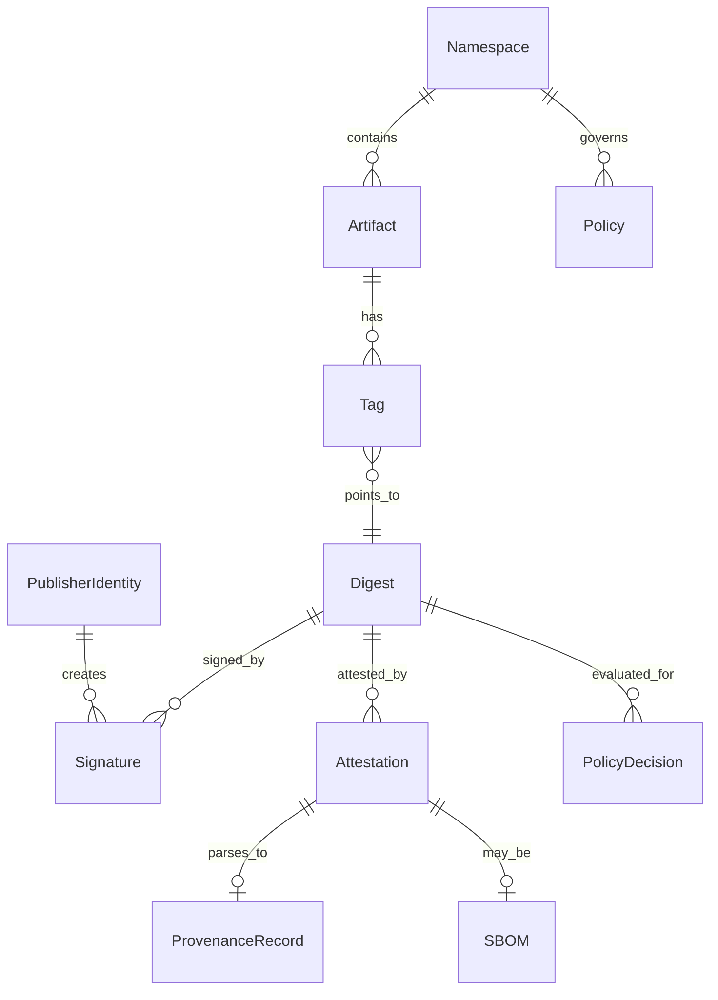

# Metadata Model

## Summary

This spec defines core entities, relationships, immutability rules, and where data lives among PostgreSQL, the OCI registry, and object storage. It enables consistent references across publishing, signing, provenance, and policy specs.

See [00-overview.md](00-overview.md) and [architecture.md](architecture.md).

## Goals

- Provide a stable entity model for the Lineagis API and feature specs.
- Clarify registry vs database vs blob responsibilities.
- Enforce digest immutability and explicit tag semantics.

## Non-goals

- SQL schemas, migrations, or ORM mappings.
- Full OCI manifest layout documentation (reference OCI specs instead).
- Historical analytics or time-series telemetry storage.

## Entity glossary

| Entity | Description |
|--------|-------------|
| **Namespace** | Top-level isolation boundary (e.g. `gh/org/repo` or operator-defined). |
| **Artifact** | Logical software unit within a namespace (e.g. package name, image name). |
| **Version / Tag** | Mutable label (semver) mapping to exactly one digest at a time. |
| **Digest** | Immutable content address for a manifest or blob (`algorithm:hex`). |
| **Manifest** | OCI manifest referencing blobs; stored in registry. |
| **Blob** | OCI layer or artifact file content; stored in registry/object storage. |
| **Signature** | Cryptographic signature over artifact digest (Sigstore bundle). |
| **Attestation** | in-toto Statement (e.g. provenance, SBOM) bound to digest. |
| **ProvenanceRecord** | Parsed provenance fields extracted from attestation for querying. |
| **SBOM** | Attestation or blob with predicate type SPDX or CycloneDX. |
| **PublisherIdentity** | OIDC-derived identity (issuer, subject, repository, workflow ref). |
| **Policy** | Versioned rule set attached to a namespace. |
| **PolicyDecision** | Outcome of evaluating policies (`pass`, `fail`, `warn`) with reasons. |
| **TrustStatus** | Aggregated view of signatures, attestations, and policy for a digest. |

## Entity relationships

## Storage placement matrix

| Data | PostgreSQL | OCI registry / manifest | Object storage (via registry) |
|------|:----------:|:-------------------------:|:-----------------------------:|
| Blob bytes | | | ✓ (addressed by digest) |
| Manifest JSON | | ✓ | ✓ (blob) |
| Tag → digest mapping | ✓ | ✓ (registry tag API) | |
| Artifact logical name | ✓ | | |
| Namespace config | ✓ | | |
| Signature bundle reference | ✓ (URI, digest, publisher id) | ✓ (optional OCI referrers/attachment) | ✓ (if stored as blob) |
| Attestation envelope | ✓ (index + digest link) | ✓ (attachment) | ✓ (blob) |
| Parsed provenance fields | ✓ | | |
| SBOM index (format, digest) | ✓ | | |
| Policy definitions | ✓ | | |
| Policy decision history | ✓ | | |
| Trust status cache | ✓ (optional cache) | | |
| Audit events | ✓ | | |

**Rules:**

- **FR-META-001 (Must):** Blob content addressed by digest SHALL NOT be overwritten in place.
- **FR-META-002 (Must):** Tag updates SHALL record the previous digest mapping in audit history (or event log) when a tag is moved.
- **FR-META-003 (Must):** Signatures and attestations SHALL reference the artifact manifest digest they cover.
- **FR-META-004 (Should):** Large attestation payloads SHOULD be stored as registry blobs with an index row in PostgreSQL.

## Immutability and tagging semantics

| Operation | Behavior |
|-----------|----------|
| Push same blob content | Idempotent; same digest returned. |
| Push new content | New digest; prior digest remains addressable. |
| Apply tag `v1.0.0` to digest D1 | Tag resolves to D1. |
| Re-apply tag `v1.0.0` to digest D2 | Tag now resolves to D2; D1 still pullable by digest. |
| Delete tag | Tag removed; digests and blobs remain unless garbage-collected by operator policy (out of MVP scope). |

## Functional requirements

| ID | Priority | Requirement |
|----|----------|-------------|
| FR-META-001 | Must | Every published artifact version SHALL be uniquely identified by a manifest digest. |
| FR-META-002 | Must | Tags SHALL resolve to at most one manifest digest per artifact at any instant. |
| FR-META-003 | Must | Signatures and attestations SHALL be associated with the manifest digest they cover. |
| FR-META-004 | Must | The metadata DB SHALL index namespace, artifact name, tag, digest, and trust-related records for query by the API. |
| FR-META-005 | Should | Provenance fields (repository URL, commit, workflow) SHALL be extractable from attestations into queryable columns. |
| FR-META-006 | Should | SBOM attestations or attachments SHALL be indexed by format and digest. |
| FR-META-007 | Deferred | Cross-registry artifact aliases and federation IDs. |

## Non-functional requirements

| ID | Requirement |
|----|-------------|
| NFR-META-001 | Referential integrity between tag rows and known digests SHALL be enforced at API write time. |
| NFR-META-002 | Metadata DB backups SHALL be sufficient to reconstruct trust status given registry content still exists. |

## Retention

| Data | MVP retention |
|------|----------------|
| Blobs by digest | Until operator GC policy (not specified in MVP) |
| Policy versions | All versions retained for audit |
| Policy decisions | Retained minimum 90 days (operator-configurable) |
| Audit events | Retained minimum 90 days |

## Standards and references

- [OCI Image Spec — Manifest](https://github.com/opencontainers/image-spec/blob/main/manifest.md)
- [OCI Distribution Spec](https://github.com/opencontainers/distribution-spec)
- [in-toto Statement v1](https://github.com/in-toto/attestation/tree/main/spec/v1)

## Dependencies

- [architecture.md](architecture.md)
- [api.md](api.md)

## Acceptance criteria

| ID | Criterion | Maps to |
|----|-----------|---------|
| AC-META-001 | Given two publishes of identical bytes, when digests are compared, then they are equal. | FR-META-001 |
| AC-META-002 | Given tag `v1.0.0` on digest D1 then moved to D2, when pulling by digest D1, then content is unchanged. | FR-META-002 |
| AC-META-003 | Given a signature for digest D, when trust status is requested for digest D′ ≠ D, then signature is not counted. | FR-META-003 |

## Open questions

| ID | Question |
|----|----------|
| OQ-META-001 | Use OCI referrers API vs custom attestation attachment layout for MVP? |
| OQ-META-002 | Store Sigstore bundle only in DB vs also as OCI artifact layer? |
