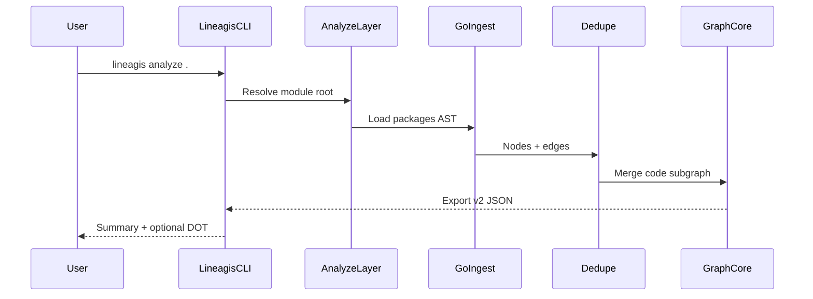

# Lineagis Repository Self-Analysis — Specification (v1.1+)

## Spec summary (agent index)

| Section | Key points |
| ------- | ---------- |
| [Objective](#objective) | `lineagis analyze .` builds a deterministic code + provenance knowledge graph |
| [Agent context](#agent-context) | Commands, tests, layout, boundaries; depends on v1.0 lineage MVP |
| [Delivery matrix](#delivery-matrix) | v1.1 Must/Should / v1.2+ Deferred |
| [Data model](#data-model) | Code-graph node/edge types; provenance subgraph unchanged |
| [Implementation phases](#implementation-phases) | SA-P1 … SA-P10; one phase per PR |
| [Requirements](#functional-requirements) | `FR-SA-*`, `AC-SA-*` with Must/Should/Deferred tags |
| [Conformance](#conformance-fixtures) | YAML fixtures agents must pass before marking a phase done |

**Informative design input:** [Self-Analysis Design Plan](../plans/Self-Analysis%20Design%20Plan.md).

**Prerequisite spec:** [lineage-engine-mvp.md](lineage-engine-mvp.md) — v1.0 provenance engine (`FR-LIN-*`, P1–P6) MUST be complete on `main` before SA-P1 Build starts.

**Product scope:** Extends Lineagis with repository self-analysis (dogfooding). Does not change v1.0 SBOM/git/build ingest semantics.

---

## Objective

Lineagis SHALL analyze its own repository (and other Go module trees) to produce a **navigable, deterministic knowledge graph** that merges:

1. **Provenance subgraph** (v1.0): commit → build → artifact → dependency
2. **Code subgraph** (v1.1+): module → package → file → symbol, with import relationships

**Success looks like:**

1. A maintainer runs `lineagis analyze .` on this repository.
2. The tool materializes module, package, file, and symbol nodes with `contains` and `imports` edges.
3. The graph exports deterministically as JSON (`lineage-graph/v2`).
4. Optional queries explain package dependencies, test coverage links, and architectural boundaries (later phases).
5. CI runs self-analysis on pull requests and fails on declared architecture violations (SA-P6+).

**Primary primitive:** explainability — the repository demonstrates Lineagis by explaining itself.

---

## Agent context

### Commands

| Action | Command |
| ------ | ------- |
| Analyze repository (SA-P1) | `./bin/lineagis analyze .` |
| Analyze with JSON output | `./bin/lineagis analyze . --format json` |
| Analyze package import subgraph (Should) | `./bin/lineagis analyze . --format dot` |
| Merge with provenance ingest | `./bin/lineagis ingest …` then `lineagis analyze .` (same graph session) |
| Lineage tests (existing) | `make test-lineage` |
| Self-analysis tests (target) | `go test ./internal/ingest/go/... ./internal/analyze/... ./tests/conformance/...` |

### Testing

| Topic | Rule |
| ----- | ---- |
| Framework | Go `testing` package; table-driven tests preferred |
| Unit test location | Co-located `*_test.go` beside source |
| Conformance | Pass cases in [conformance fixtures](#conformance-fixtures) before marking SA-P* done |
| Fixture module | `examples/self-analysis/` — minimal Go module for portable tests |
| Self-check | List `FR-SA-*` / `AC-SA-*` addressed in PR description |

### Project structure (target)

```text
cmd/lineagis/
  analyze.go                 # thin CLI (SA-P1)
internal/
  analyze/                   # orchestrates repo scan → dedupe.Apply
  ingest/
    go/                        # go/packages loader, AST walk (SA-P1)
    docs/                      # markdown ingest (SA-P2)
    workflow/                  # GitHub Actions YAML (SA-P2)
  core/                        # extend model for code-graph types
examples/
  self-analysis/               # mini-module conformance fixture
generated/                     # SA-P5 output tree (gitignored until implemented)
tests/conformance/
  self-analysis-lineagis.yaml
  self-analysis-mini.yaml
docs/specs/
  self-analysis.md             # this document
```

**Boundaries:**

- Graph logic → `internal/core/` only
- Go AST parsing → `internal/ingest/go/`
- CLI wiring → `cmd/lineagis/` (thin; delegate to `internal/analyze`)
- Reuse [`internal/normalize/dedupe`](../internal/normalize/dedupe/dedupe.go) and [`internal/lineage/ingest.go`](../internal/lineage/ingest.go) patterns

### Git workflow

Same as [lineage-engine-mvp.md#git-workflow](lineage-engine-mvp.md): branch `story/sa-p1-analyze`, spec refs in PR body, human approval before merge.

### Boundaries

**Always**

- Preserve v1.0 provenance DAG invariants (`built_from`, `produced_by` cycle rejection).
- Produce deterministic graph export for identical repository state.
- Dedupe nodes and edges across repeated `analyze` calls in one session.
- Keep offline-capable analysis (no network for local repo scan).

**Ask first**

- Changing canonical ID format for code-graph nodes.
- Persisting code graphs to Postgres (v1.1 Should per lineage matrix).

**Approved dependencies**

- `golang.org/x/tools` (`go/packages`) — approved for SA-P1 AST analysis ([OQ-SA-001](#open-questions)).

**Never**

- Break v1.0 `FR-LIN-*` / `AC-LIN-*` semantics.
- Reject import cycles among package nodes (report only).
- Implement SA-P2+ features under SA-P1 tasks without human approval.

---

## Summary

Self-analysis makes Lineagis its own flagship example: every commit can regenerate a knowledge graph covering source structure, dependencies, documentation, CI, and supply-chain provenance. v1.1 delivers AST-aware repository analysis; v1.2+ adds living docs, impact reports, and release artifacts.

## Goals

- Dogfood: answer "why does this package exist?", "who imports it?", "what tests cover it?"
- Merge provenance and code structure in one exportable graph.
- Generate deterministic reports and diagrams from graph state.
- CI regression: architecture rules and documentation consistency.

## Non-goals

- Replacing v1.0 SBOM/git/build ingest semantics.
- Persistent graph storage in SA-P1 (in-memory; Postgres deferred to lineage v1.1 Should).
- Multi-repo federation, Sigstore, REST API, HTML dashboard.
- Deployment-node automation.
- SA-P1 does **not** require Makefile parsing, GitHub Actions ingest, or release publishing.

## Personas

| Persona | Description |
| ------- | ----------- |
| **Maintainer** | Wants the repo to explain its own layout and dependencies. |
| **Contributor** | Needs impact and architecture guidance on pull requests. |
| **Agent implementer** | Implements one [SA-P* phase](#implementation-phases) at a time. |

## Delivery matrix

| Capability | v1.1 Must | v1.1 Should | v1.2+ Deferred |
| ---------- | --------- | ----------- | -------------- |
| `lineagis analyze <path>` (Go module AST) | ✓ | | |
| Code-graph nodes: module, package, file, symbol | ✓ | | |
| Code-graph edges: `contains`, `imports` | ✓ | | |
| Graph export `lineage-graph/v2` | ✓ | | |
| Package import DOT visualization | | ✓ | |
| Doc nodes + `documents` edges | | ✓ | |
| Test file `tests` edges | | ✓ | |
| GitHub workflow nodes | | ✓ | |
| `go.mod` external module intelligence | | ✓ | |
| CI self-analysis on PRs | | ✓ | |
| Provenance ↔ code bridge edges | | ✓ | |
| Living architecture markdown | | | ✓ |
| `generated/` artifact tree | | | ✓ |
| Declarative architecture rules | | | ✓ |
| Package-scoped `why` / `impact` | | | ✓ |
| Release lineage artifacts | | | ✓ |

---

## Data model

### Graph domains

v2 graphs contain two logical domains in one store:

| Domain | Node types | Cycle policy |
| ------ | ---------- | ------------ |
| `provenance` | commit, build, artifact, dependency (v1.0) | DAG enforced for `built_from`, `produced_by` |
| `code` | module, package, file, symbol, doc, workflow, target (phased) | `imports` cycles allowed; detected in reports only |

### Node types

#### SA-P1 Must

| Type | ID pattern | Required metadata |
| ---- | ---------- | ----------------- |
| `module` | `module:{path}` | `path`; optional `go_version` |
| `package` | `package:{importPath}` | `name`, `dir` |
| `file` | `file:{repoRelPath}` | `language` (e.g. `go`) |
| `symbol` | `symbol:{importPath}#{name}` | `kind` (`func`, `method`, `struct`, `interface`) |

#### SA-P2 Should

| Type | ID pattern | Required metadata |
| ---- | ---------- | ----------------- |
| `doc` | `doc:{repoRelPath}` | `format` (e.g. `markdown`) |
| `workflow` | `workflow:{name}` | `path` |
| `target` | `target:{name}` | `kind` (e.g. `make`) |

v1.0 provenance node types are unchanged; see [lineage-engine-mvp.md#data-model](lineage-engine-mvp.md#data-model).

### Edge types

#### SA-P1 Must

| Edge | Direction | Semantics |
| ---- | --------- | --------- |
| `contains` | module → package, package → file, file → symbol | Structural containment |
| `imports` | package → package | Go import (in-repo and external) |

#### SA-P2 Should

| Edge | Direction | Semantics |
| ---- | --------- | --------- |
| `documents` | doc → package | Documentation references package |
| `tests` | file → package | Test file exercises package |
| `runs_in` | workflow → target | CI workflow runs build target |
| `builds` | target → artifact | Build output (when known) |

#### Bridge edges (provenance ↔ code)

| Edge | Direction | Phase | Semantics |
| ---- | --------- | ----- | --------- |
| `introduced_by` | package → commit | SA-P2 Should | Package introduced in commit |
| `contains` | artifact → module | SA-P2 Should | Built artifact contains module tree |

### Graph invariants

1. **Provenance subgraph:** Unchanged v1.0 rules — `built_from` and `produced_by` must remain acyclic among commit/build/artifact nodes.
2. **Code subgraph:** `imports` edges MAY form cycles among `package` nodes; the engine SHALL NOT reject them. Cycle detection is reporting-only (SA-P4 metrics).
3. **Canonical IDs:** Same entity resolves to the same node ID across `analyze` and `ingest` calls.
4. **Determinism:** Ingest and analyze order must not change final graph topology when events describe the same facts.
5. **Dedupe:** Repeated `analyze` or `ingest` calls deduplicate by node ID and edge triple.

### Reference examples

Package node:

```json
{
  "id": "package:github.com/BrendenWalker/lineagis/internal/core/graph",
  "type": "package",
  "metadata": {
    "name": "graph",
    "dir": "internal/core/graph"
  }
}
```

Import edge:

```json
{
  "from": "package:github.com/BrendenWalker/lineagis/cmd/lineagis",
  "to": "package:github.com/BrendenWalker/lineagis/internal/core/query",
  "type": "imports"
}
```

### JSON envelope (v2)

```json
{
  "schema_version": "lineage-graph/v2",
  "domains": ["provenance", "code"],
  "nodes": [],
  "edges": []
}
```

v1.0 exports (`lineage-graph/v1`) remain valid for provenance-only graphs.

---

## User stories

| ID | Priority | Story |
| -- | -------- | ----- |
| US-SA-001 | Must | As a maintainer, I want `lineagis analyze .` so that I see package and import structure without manual diagrams. |
| US-SA-002 | Must | As a maintainer, I want symbol-level nodes so that I can trace functions and types in the graph. |
| US-SA-003 | Should | As a contributor, I want doc and test linkage so that I know what validates and documents each package. |
| US-SA-004 | Should | As an operator, I want CI to run self-analysis so that architectural drift is caught on PRs. |
| US-SA-005 | Deferred | As a contributor, I want `lineagis impact package …` so that I see blast radius before merging (v1.2). |
| US-SA-006 | Deferred | As a release manager, I want lineage artifacts attached to releases so that versions are comparable (SA-P10). |

**Note:** `US-LIN-008` (artifact/commit `impact`) in the lineage spec addresses supply-chain blast radius. `US-SA-005` addresses **code** impact; both may share query infrastructure in v1.2 but serve different refs.

---

## Functional requirements

### Repository analysis (SA-P1)

| ID | Priority | Requirement |
| -- | -------- | ----------- |
| FR-SA-001 | Must | The CLI SHALL provide `lineagis analyze <path>` where `<path>` is a Go module root directory. |
| FR-SA-002 | Must | Analysis SHALL use `go/parser` and `go/types`, loading packages via `go/packages` or equivalent ([OQ-SA-001](#open-questions)). |
| FR-SA-003 | Must | Analysis SHALL emit `module`, `package`, `file`, and `symbol` nodes with canonical IDs per [data model](#data-model). |
| FR-SA-004 | Must | Analysis SHALL emit `contains` and `imports` edges linking structural and import relationships. |
| FR-SA-005 | Must | The normalizer SHALL deduplicate nodes and edges via `internal/normalize/dedupe` across repeated `analyze` calls. |
| FR-SA-006 | Must | Graph export SHALL use `schema_version: lineage-graph/v2` with `domains` including `code` ([OQ-SA-003](#open-questions)). |
| FR-SA-007 | Should | `analyze` SHALL support `--format dot` emitting a package-level import subgraph. |
| FR-SA-008 | Must | Analysis SHALL complete offline for a local module tree (no module download required when deps are cached). |

### Knowledge graph expansion (SA-P2)

| ID | Priority | Requirement |
| -- | -------- | ----------- |
| FR-SA-010 | Should | Analysis SHALL ingest markdown files under `docs/` as `doc` nodes. |
| FR-SA-011 | Should | The engine SHALL emit `documents` edges from doc nodes to referenced packages (path/heuristic matching). |
| FR-SA-012 | Should | The engine SHALL emit `tests` edges from `*_test.go` files to the package under test. |
| FR-SA-013 | Should | Analysis SHALL parse `.github/workflows/*.yml` as `workflow` nodes with `runs_in` edges where inferable. |
| FR-SA-014 | Should | Bridge edges (`introduced_by`, artifact→module `contains`) SHALL link code and provenance subgraphs when git/build metadata is present. |

### Dependency intelligence (SA-P3)

| ID | Priority | Requirement |
| -- | -------- | ----------- |
| FR-SA-020 | Should | Analysis SHALL read `go.mod` and emit `module` nodes for direct `require` directives not already in the repo. |
| FR-SA-021 | Should | External module nodes SHALL include metadata: import count, introducing commit (when available). |

### Query and exploration (SA-P9)

| ID | Priority | Requirement |
| -- | -------- | ----------- |
| FR-SA-030 | Deferred | `lineagis why package <importPath>` SHALL explain upstream package dependencies and provenance links. |
| FR-SA-031 | Deferred | `lineagis impact package <importPath>` SHALL list downstream packages, tests, and docs affected. |
| FR-SA-032 | Deferred | `lineagis explain dependency <modulePath>` SHALL summarize purpose, importers, and removal impact. |

### CI and architecture rules (SA-P6, SA-P7)

| ID | Priority | Requirement |
| -- | -------- | ----------- |
| FR-SA-040 | Should | CI SHALL run `lineagis analyze .` on pull requests. |
| FR-SA-041 | Deferred | The system SHALL support declarative architecture rules (e.g. `lineagis.arch.yaml`) validated against the code subgraph. |
| FR-SA-042 | Deferred | Rule violations SHALL fail CI with actionable messages naming forbidden imports. |

### Reports and generated artifacts (SA-P4, SA-P5, SA-P10)

| ID | Priority | Requirement |
| -- | -------- | ----------- |
| FR-SA-050 | Deferred | The system SHALL generate architecture markdown from the code subgraph (package hierarchy, import metrics). |
| FR-SA-051 | Deferred | The system SHALL write artifacts under `generated/architecture/`, `generated/reports/`, `generated/diagrams/`. |
| FR-SA-052 | Deferred | Releases SHALL attach `lineage.json`, dependency reports, and diagram exports (SA-P10). |

---

## Non-functional requirements

| ID | Requirement |
| -- | ----------- |
| NFR-SA-001 | Analyze of this repository (≈50 packages) SHALL complete in <30s on a developer laptop (informative). |
| NFR-SA-002 | Memory use SHALL scale linearly with nodes and edges; no unbounded caches across CLI invocations. |
| NFR-SA-003 | JSON output schema SHALL be versioned in this spec (`lineage-graph/v2`). |
| NFR-SA-004 | Same repository state analyzed twice SHALL produce identical node and edge adjacency. |
| NFR-SA-005 | Error messages SHALL name the failing path, package, or rule and suggest remediation. |

---

## Standards and references

- [Go packages loader](https://pkg.go.dev/golang.org/x/tools/go/packages)
- [go/parser](https://pkg.go.dev/go/parser), [go/types](https://pkg.go.dev/go/types)
- [Self-Analysis Design Plan](../plans/Self-Analysis%20Design%20Plan.md) — informative vision
- [lineage-engine-mvp.md](lineage-engine-mvp.md) — v1.0 provenance spec
- [lineagis_design.md](../lineagis_design.md) — product roadmap

## Dependencies

- [lineage-engine-mvp.md](lineage-engine-mvp.md) — v1.0 graph core, ingest, query (P1–P6 complete)
- [lineagis_architecture_overview.md](../lineagis_architecture_overview.md) — layer boundaries for SA-P7 rules

---

## Implementation phases

Agents SHALL implement **one SA-P phase per task/PR** unless a human explicitly approves bundling.

**Gate:** Do not start SA-P1 until v1.0 P1–P6 pass on `main`.

| Design plan phase | Spec phase | Version | Scope | Exit criterion |
| ----------------- | ---------- | ------- | ----- | -------------- |
| Phase 1 — Repository self-analysis | **SA-P1** | v1.1 Must | `analyze`, Go AST, code-graph nodes/edges | Conformance: `self-analysis-lineagis.yaml`, `self-analysis-mini.yaml` |
| Phase 2 — Knowledge graph | **SA-P2** | v1.1 Should | Docs, tests, workflows, bridge edges | Conformance: doc/test link fixtures |
| Phase 3 — Dependency intelligence | **SA-P3** | v1.1 Should | `go.mod` external modules | Conformance: external module fixture |
| Phase 4 — Living architecture | **SA-P4** | v1.2 Deferred | Generated architecture markdown | AC-SA-010 |
| Phase 5 — Self-generated reports | **SA-P5** | v1.2 Deferred | `generated/` tree | AC-SA-011 |
| Phase 6 — CI integration | **SA-P6** | v1.1 Should | PR analyze job | CI green on self-analysis |
| Phase 7 — Architectural fitness | **SA-P7** | v1.2 Deferred | `lineagis.arch.yaml` rules | AC-SA-012 |
| Phase 8 — Impact analysis | **SA-P8** | v1.2 Deferred | PR impact report | AC-SA-013 |
| Phase 9 — Repository explorer | **SA-P9** | v1.2 Deferred | Package `why` / `impact` / `explain` | Conformance query fixtures |
| Phase 10 — Release artifacts | **SA-P10** | v1.2+ Deferred | Release-attached lineage assets | Release smoke |

Do not pull SA-P4+ report generation into SA-P1. SA-P1 Build MAY add `golang.org/x/tools` per [OQ-SA-001](#open-questions) (approved).

---

## End-to-end flow

### Analyze repository



---

## Acceptance criteria

| ID | Criterion | Maps to |
| -- | --------- | ------- |
| AC-SA-001 | Given `examples/self-analysis/`, when `lineagis analyze` runs, then expected `imports` edge exists between fixture packages. | FR-SA-001, FR-SA-003, FR-SA-004 |
| AC-SA-002 | Given a analyzed graph, when `analyze` runs again on the same path, then node and edge counts are unchanged. | FR-SA-005, NFR-SA-004 |
| AC-SA-003 | Given this repository, when `analyze .` runs, then `cmd/lineagis` imports `internal/core/query`. | FR-SA-004 |
| AC-SA-004 | Given this repository, when `analyze .` runs, then exported symbol nodes exist (e.g. `internal/core/graph#New`). | FR-SA-002, FR-SA-003 |
| AC-SA-005 | Given SBOM sidecars ingested then `analyze .`, when the graph exports, then provenance and code node IDs do not collide. | FR-SA-005, FR-SA-006 |
| AC-SA-006 | Given `--format json`, when analyze succeeds, then stdout parses with `schema_version`, `domains`, `nodes`, and `edges`. | FR-SA-006, NFR-SA-003 |
| AC-SA-010 | Given a complete code subgraph, when architecture report generates, then package count and import metrics match graph state. | FR-SA-050 |
| AC-SA-011 | Given analyze completes, when report phase runs, then `generated/` contains expected artifacts deterministically. | FR-SA-051 |
| AC-SA-012 | Given `lineagis.arch.yaml` forbidding `cmd` → `storage`, when analyze validates, then forbidden import fails with named packages. | FR-SA-041, FR-SA-042 |
| AC-SA-013 | Given a PR modifying `internal/core/graph`, when impact runs, then report lists downstream packages and tests. | FR-SA-031, SA-P8 |

---

## Conformance fixtures

Implement under `tests/conformance/`. YAML files drive analyze + expected graph/query output. Go tests mirror YAML (same pattern as v1.0 conformance).

### SA-P1 exit: this repository

```yaml
# tests/conformance/self-analysis-lineagis.yaml
name: self-analysis-lineagis
command: analyze .
expect:
  exit_code: 0
  nodes_contain:
    - package:github.com/BrendenWalker/lineagis/internal/core/graph
    - package:github.com/BrendenWalker/lineagis/cmd/lineagis
  edges_contain:
    - from: package:github.com/BrendenWalker/lineagis/cmd/lineagis
      to: package:github.com/BrendenWalker/lineagis/internal/core/query
      type: imports
  symbols_contain:
    - symbol:github.com/BrendenWalker/lineagis/internal/core/graph#New
```

### SA-P1 exit: mini-module fixture

```yaml
# tests/conformance/self-analysis-mini.yaml
name: self-analysis-mini
command: analyze examples/self-analysis
expect:
  exit_code: 0
  nodes_contain:
    - package:github.com/BrendenWalker/lineagis/examples/self-analysis/app
    - package:github.com/BrendenWalker/lineagis/examples/self-analysis/lib
  edges_contain:
    - from: package:github.com/BrendenWalker/lineagis/examples/self-analysis/app
      to: package:github.com/BrendenWalker/lineagis/examples/self-analysis/lib
      type: imports
```

### Example architecture rules (SA-P7, informative)

```yaml
# lineagis.arch.yaml (future)
layers:
  - cmd
  - query
  - graph
  - storage
forbidden:
  - from: cmd
    to: storage
```

Agents MUST NOT mark SA-P1 complete until `self-analysis-lineagis.yaml` and `self-analysis-mini.yaml` pass in CI.

---

## CLI reference (v1.1 target)

```bash
# Analyze Go module at path (default: current directory)
lineagis analyze .
lineagis analyze . --format json
lineagis analyze . --format dot > imports.dot

# Merge with provenance ingest in same session
lineagis ingest examples/sbom-cyclonedx.json
lineagis analyze .
```

### Deferred commands (SA-P9)

```bash
lineagis why package github.com/BrendenWalker/lineagis/internal/core/graph
lineagis impact package github.com/BrendenWalker/lineagis/internal/core/graph
lineagis explain dependency golang.org/x/tools
```

---

## Open questions

| ID | Question | Default if unresolved |
| -- | -------- | --------------------- |
| OQ-SA-001 | Approve `golang.org/x/tools` (`go/packages`) as dependency? | **Resolved:** approved for SA-P1 (human, 2026-07-02) |
| OQ-SA-002 | Command name: `analyze` vs `ingest repo`? | **`analyze`** — `ingest` remains file-based (SBOM/sidecars) |
| OQ-SA-003 | Graph schema: `lineage-graph/v2` vs nested field in v1? | **`lineage-graph/v2`** with `domains: [provenance, code]` |
| OQ-SA-004 | External module nodes: full module graph or direct requires only? | **Direct `go.mod` requires only** in SA-P3 |
| OQ-SA-005 | Commit `introduced_by`: git blame vs first-commit heuristic? | **Deferred to SA-P2**; manual sidecar allowed |

---

## Agent self-check (before PR)

1. List each `FR-SA-*` addressed and the test/fixture that proves it.
2. Confirm v1.0 `FR-LIN-*` behavior unchanged unless explicitly cross-cutting.
3. Run `make test-lineage` (and self-analysis tests when implemented).
4. Note any **Ask first** items and whether human approval was obtained (OQ-SA-001: approved).
5. Map PR to exactly one SA-P phase.

---

*Living document — update when v1.1 scope changes or conformance fixtures are added.*
